# IPsec VPN Site-to-Site between 2 Cisco routers
This lab, conducted in the **GNS3** simulation environment, is an  example of deploying a traditional site-to-site IPsec VPN of the “router-to-router” type. 
**Exemple de sortie pour `show crypto ipsec sa` :**

It represents the network and security architecture that has been extensively and historically proven in traditional enterprise environments using Cisco IOS equipment.
This project illustrates the fundamental mechanisms of IPsec on Cisco IOS.

<h1> Overview & Objectives </h1>

This project consists of designing and deploying a site-to-site IPsec VPN tunnel between two Cisco routers (IOS).

The IPsec tunnel will protect :
- LAN ↔ LAN traffic
- ICMP data
- internal IP packets

<h1> Network Architecture </h1>

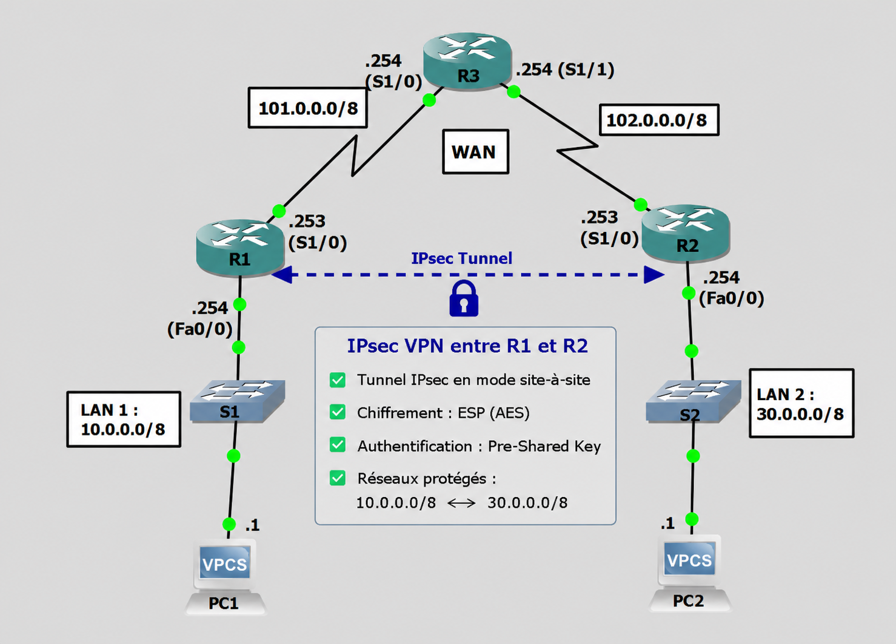</img>

<h3> Functions of the équipments </h3>

- R1 : Gateway VPN of the LAN A
    - Serial 1/0 represent the “OUTSIDE” security zone (simulation of the public Internet connection with R3).
    - Fa0/0 is connected to the “INSIDE” zone, LAN 1
- R2 : Gateway VPN of the LAN B
    - Serial 1/0 represent the “OUTSIDE” security zone (simulation of the public Internet connection with R3).
    - Fa0/0 is connected to the “INSIDE” zone, LAN 2
- R3 : Router that simulate “Internet”  (zone OUTSIDE)
- PC1 / PC2 : machines internes (zone INSIDE)

<h3> Goal  </h3>
Enable PC1 (10.0.0.0/8) and PC2 (30.0.0.0/8) to communicate end-to-end in a transparent and highly secure manner by establishing a ipsec tunnel between the Cisco gateways R1 and R2.

<h1> How IPsec VPN Works  (theorically) </h1>
When a connection is initiated (e.g., PC1 pings PC2, 10.0.0.1 → 30.0.0.1), the IPsec process is activated on the Cisco gateway (e.g, R1):

- **Detection of “Interesting Traffic”**: The router checks whether the packet matches the Crypto ACL.
- **Application of the Crypto Map**: If the traffic matches, the security policy is activated.
- **Encryption & Encapsulation**: The original packet is encrypted using the algorithm suite and then encapsulated in an ESP header before being sent over the WAN.

The process consists of two distinct phases:    

<h3> 🔐 Phase 1 — IKE / ISAKMP (Control canal) </h3>
Establishment of a secure negotiation channel between the two peers (IKE SA).

- **Negotiation**: Validation of a shared security policy. 
- **Diffie-Hellman exchange**: Generation of identical secret symmetric keys.
- **Mutual authentication**: Validation of identities via a pre-shared key (PSK).
- **Selected/negotiated parameters**: AES encryption, SHA hashing, DH Group 2 (1024 bits), lifetime of 86,400 seconds.
    
*strongSwan equivalent of IPsec settings:
`ike=aes256-sha256-modp1024`*

<h3> 🔐 Phase 2 — IPsec / ESP (Data canal) </h3>
Creation of real data tunnels (CHILD SA / ESP SA) to transport user traffic LAN↔LAN.

- **Algorithm negotiation:** Selection of encryption (AES) and integrity (SHA-HMAC) methods via a Transform-Set.
- **Unidirectional tunnels:** Generation of two distinct Security Associations (SA) (one incoming SA, one outgoing SA).

Configured elements:
- ACL “interesting traffic”
- ESP transform set AES + SHA
- Crypto-map applied to the WAN interface

*strongSwan equivalent of IPsec settings: 
`esp=aes256-sha256`*

<h3> ⚙️ Configuration Details (R1 & R2) </h3>

Each VPN gateway has been configured to establish the tunnel securely. Below are the configuration files associated with each router:

[Router R1 Configuration (Gateway A)](config/R1.txt): ISAKMP, Transform-Set, and Crypto-Map settings.

[Router R2 Configuration (Gateway B)](config/R2.txt): Mirror of the R1 configuration with reversed access policies.

<h1> Configuration Steps on Cisco IOS </h1>

<h3>Step 1: Configuring the IKE Phase 1 Policy (ISAKMP) </h3>
First, enable ISAKMP and configure the global security policy for Phase 1 on the edge routers (R1 and R2)

<h3> Step 2: Configuring IKE Phase 2 (IPsec Parameters) </h3>

  1. Defining the "interesting traffic" (Crypto ACL)

The ACL allows you to specify exactly which networks (<=> traffic) should be allowed to enter the tunnel.
  
  2. Creating the `transform Set`

Le `transform-set` définit les algorithmes de chiffrement et d'intégrité appliqués aux données. 
  
  3. Creating and defining the `crypto map`

La `crypto map` lie l'ensemble des éléments (ACL, Pair, Transform-set).

<h3> Step 3: Applying the `Crypto Map` to the external interface (WAN) </h3>

C'est l'application de la `crypto map` sur l'interface de sortie qui active l'écoute et le traitement IPsec du trafic.

<h1>  Verification of the IPsec tunnel configuration </h1>

- `show crypto isakmp policy` : view all the security policy implemented for the IKE Phase 1 

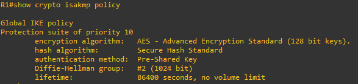
  
- `show crypto map` :View the connection between the ACL, the peer's address, and the physical interface where the crypto map is applicated

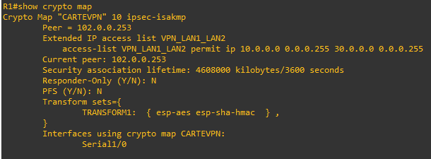
  
- `show crypto isakmp sa` :  Check the status of the control link. The status should show QM_IDLE (Phase 1 active and pending) when traffic is sent to the tunnel.

**Before tunnel:**  
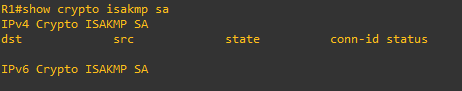  

**After tunnel:**  
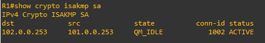
  
  
- `show crypto ipsec sa` : View encryption counters, the Phase 2 (ESP) status, and local and remote SPIs

**Before tunnel:**  
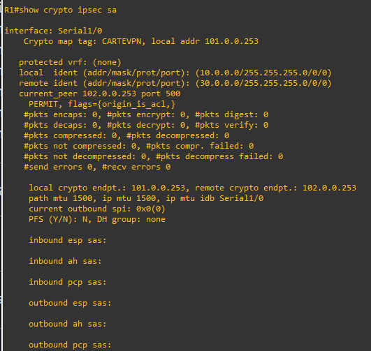  

**After tunnel:**  
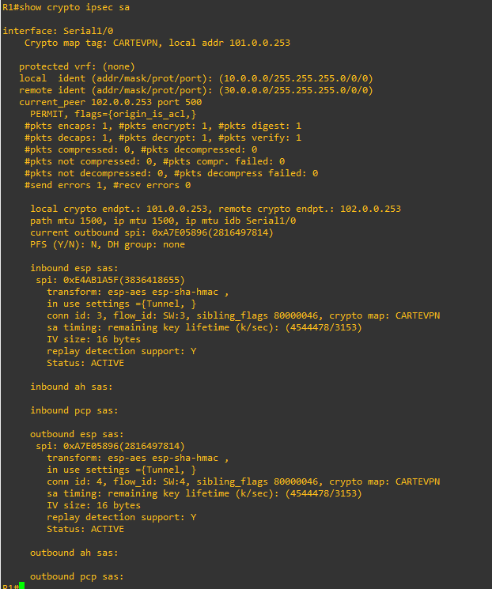
  
<h1> Analysis via Wireshark </h1>

<h3> Before the activation of IPsec  </h3>

When capturing traffic on PC1-R1 (LAN network) interfaces, the analysis of the ping shows the packet traveling completely transparently. 
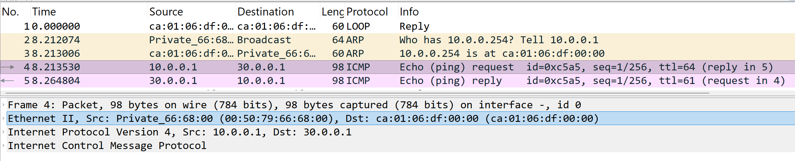

When capturing traffic on WAN interfaces (Internet transit network), the analysis of the ping shows the packet traveling completely transparently. 
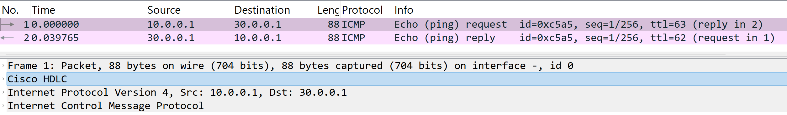

<ins> Observation </ins> : The traffic is transmitted in clear text and the gateway (R1) has no encryption settings. Internal private addresses  (10.0.0.1 / 30.0.0.1) are exposed to everyone, and the application data (ICMP payload) is visible to any intermediate device located along the transit path (R3). 

<h3> After the activation of IPsec  </h3>
When the second successful ping is sent, the network capture highlights the structural changes to the frame that shows the key Points of ESP Encapsulation:
The screenshots below show ESP encapsulation in action:

- When capturing traffic on PC1-R1 (LAN network) interfaces, the packet remains unchanged. The PC communicates with its gateway as usual.

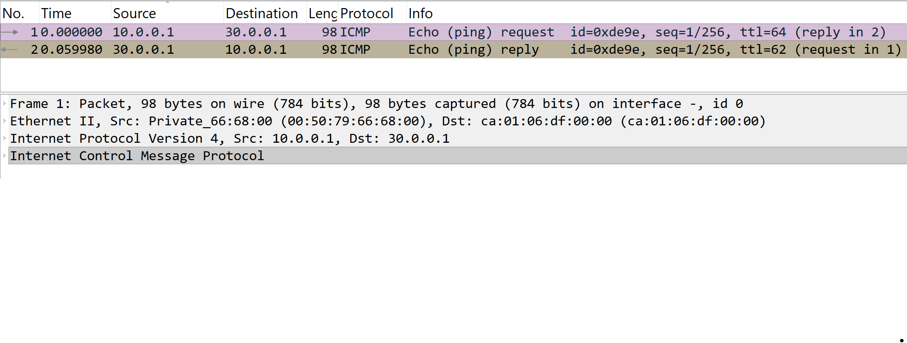

- When capturing traffic on WAN interfaces (Internet transit network), the analysis of the ping shows an ESP packet traveling with no ICMP packet visible :  The ICMP packet is encapsulated & the original IP header is hidden.

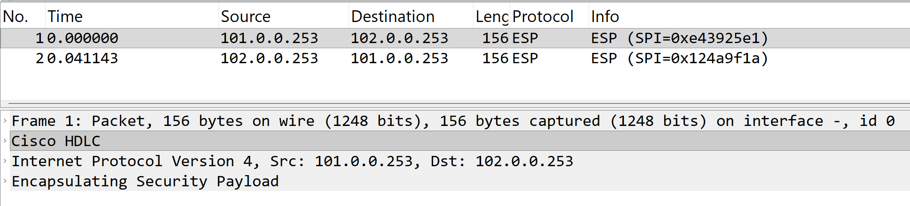 

*You can find the raw capture files (.pcapng) in the [captures/](captures/) folder for detailed analysis using your own copy of Wireshark.*

**Complete Obfuscation**:
  - The real host addresses (10.0.0.1 and 30.0.0.1) and the traffic type (ICMP) are encapsulated in the encrypted payload (ESP). So, private addresses are hidden.
  - Only the public VPN endpoints (101.0.0.253 and 102.0.0.253) are visible. 
  - Anti-Replay Security:  `show crypto ipsec sa` shows that the `replay detection support` attribute is enabled: A unique sequence number is associated with each ESP header to prevent the injection or malicious re-transmission of captured packets.

**Full-Duplex Architecture**:
The router creates two separate session indexes:

- an outbound SPI for tracking outgoing traffic 
- an inbound SPI for incoming traffic.

Each direction of communication has its own independent set of encryption keys 

<h1> Final result </h1>

- Operational Tunnel IPsec
- Traffic LAN ↔ LAN encrypted
- Visible ESP on R3 (WAN)
- SAs established in both directions
    
<h1> Achivements / Compétences démontrées  </h1>

- Configuring IPsec on Cisco IOS
- Understanding the IKE phases (Main Mode + Quick Mode) & ESP encryption
- Setting up crypto ACLs
- Setting up `transform-set` & `crypto-map`
- Network analysis (Wireshark)
 
<h1> Requirements </h1>
To reproduce this project, you will require to have the following environments :

- Network simulator *GNS3* 
- Cisco IOS Images :
    - Images Cisco IOS compatible with IPsec/IKEv1 (e.g., c7200), configured in *GNS3*.
    - Exact name of the IOS image used in this GNS3 project : `c7200-adventerprisek9-mz.124-24.T5.image`
- A functional **GNS3 topology** including:
  - 3 Cisco routers (R1, R2, R3)
  - 2 end-hosts (PC1, PC2) : Appliances "VPCS" (Virtual PC Simulator) integrated to *GNS3* for realizing the ping tests.
- *Wireshark* for capturing packets
