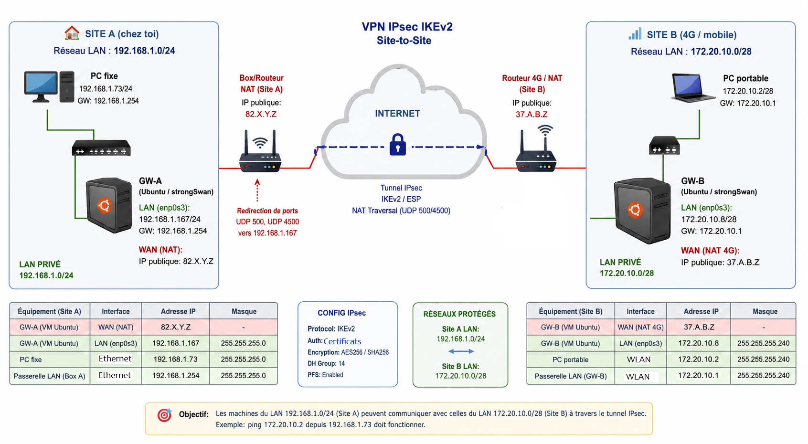

# IPsec VPN Site-to-Site with strongSwan behind NAT

<h1>Introduction to VPN </h1>

A VPN allows you to create a virtual connection between two different local networks. It creates a logical interconnection between local networks over a shared network (whether public, such as the Internet, or private, such as a corporate intranet or a carrier’s backbone) using a traffic segmentation mechanism or a tunnelling protocol. Encryption is possible but not always used.

<h1> Overview </h1>

This project consists of designing and deploying a secure IPsec IKEv2 Site-to-Site VPN tunnel between two remote LAN networks over the public Internet using strongSwan on VM Ubuntu (Linux) gateways.

The infrastructure was deployed in a real-world environment where both VPN gateways were located behind NAT devices and connected through public Internet access (Home LAN ↔ 4G Mobile Network).

The objective of this project was to securely interconnect two distant private networks while ensuring encrypted LAN-to-LAN communications through IPsec ESP tunnels.

<h1> Project Scenario </h1>
A secure communication channel was required between 2 isolated private networks connected through the Internet:
<ul> 
    <li> Home LAN network </li>
    <li> Remote LAN connected through a 4G mobile network </li>
</ul>

Both sites were located behind NAT-enabled Internet gateways, introducing additional routing and IPsec NAT Traversal (NAT-T) constraints.

</img>

The project focused on:
<ul> 
    <li> secure inter-site connectivity </li>
    <li> encrypted traffic transport </li>
    <li> routing between distant LANs </li>
</ul>

<h1> Solution </h1>
The following technologies and mechanisms were implemented:

<ul>
    <li>Deployment of an IPsec IKEv2 Site-to-Site VPN iso,g strongswan </li>
    <li>Ubuntu gateways used as VPN routers</li>
    <li>ESP encryption using AES256-GCM</li>
    <li>NAT Traversal (NAT-T) implementation for VPN communication through NAT devices</li>
    <li>LAN-to-LAN routing g between remote private subnets </li>
    <li>Initial PSK authentication</li>
    <li>Migration to PKI/X.509 authentication</li>
    <li>Traffic analysis tools</li>
    <ul>
        <li>tcpdump</li>
        <li>Wireshark</li>
        <li>ip xfrm</li>
        <li>ipsec status</li>
    </ul>
    <li>Security Association verification</li>
    <li>Validation of encrypted traffic over public Internet</li>
</ul>

<h1> Network Architecture </h1>

**Main Components** :
<ul>
<li>Linux Ubuntu VPN Gateway = GW-A (Site A)</li>
<ul>
    <li>VM on VirtualBox / VMware</li>
    <li>Connetece to the home local router/box  (behind a NAT)</li>
    <li>LAN local : 192.168.1.0/24</li>
    <li>Private IP (GW-A) : 192.168.1.167</li>
    <li>Public IP (box IP) : 82.X.Y.Z</li>
</ul>
<li>Linux Ubuntu VPN Gateway = GW-B (Site B)</li>
<ul>
    <li>Connected to a 4G mobile network (behind a NAT)</li>
    <li>LAN local : 172.20.10.0/28</li>
    <li>Private IP (GW-A) : 172.20.10.8</li>
    <li>Public IP (box IP) : 37.A.B.C</li>
</ul>
<li>Home LAN network (behind my local home router where i have access on it)</li>
<li>Remote LAN over 4G mobile access (not access to the local router)</li>
<li>NAT-enabled Internet gateways</li>
<li>Public Internet connectivity</li>
</ul>

<h1> Key Features </h1> 
<ul>
<li>IPsec IKEv2 VPN</li>
<li>ESP tunnel encryption</li>
<li>NAT Traversal (NAT-T)</li>
<li>Secure LAN-to-LAN communication</li>
<li>PKI / X.509 certificate authentication</li>
<li>Real-world deployment over public Internet</li>
<li>Advanced network troubleshooting</li>
</ul>

<h1> Verification tools used: </h1>
<ul>
<li>tcpdump</li>
<li>Wireshark</li>
<li>ip route</li>
<li>ipsec statusall</li>
<li>ip xfrm state</li>
<li>ip xfrm policy</li>
<li>journalctl & strongSwan logs</li>
</ul>

<h1> Technologies Used </h1>
<ul>
<li>Linux Ubuntu</li>
<li>strongSwan</li>
<li>IPsec features</li>
<ul> 
    <li>IKEv2</li>
    <li>ESP</li>
    <li>NAT Traversal (NAT-T)</li>
</ul>
<li>PKI & X.509 certificats</li>
<li>IP forwarding</li>
<li>Virtualization (VirtualBox)</li>
<li>tcpdump</li>
<li>Wireshark</li>
</ul>

<h1> Features Implementation </h1>

<h3> 1. VPN Site-to-Site IPsec IKEv2 </h3>

Deployment of an IPsec ESP VPN tunnel in tunnel mode, enabling secure interconnection of two remote LANs over the public internet.

**Features**:

<ul>
<li>IKEv2</li>
<li>Encrypted ESP</li>
<li>NAT Traversal enabled</li>
<li>UDP 4500 encapsulation</li>
<li>AES256-GCM encryption</li>
<li>IKE fragmentation</li>
</ul>

<h3> 2. NAT and NAT-T Management </h3>

The project included a complex real-world scenario:
<ul>
<li>GW-B behind a 4G carrier NAT</li>
<li>Lack of port forwarding control on the mobile side</li>
</ul>

**Implemented solutions**:
<ul>
<li>Use of forceencaps=yes</li>
<li>ESP encapsulation in UDP/4500</li>
</ul>

<h3> 3. Inter-network Routing </h3>

Routing configuration between:
<ul>
<li>192.168.1.0/24</li>
<li>172.20.10.0/28</li>
</ul>

**Tasks performed**:
<ul>
<li>Enabling IPv4 forwarding</li>
<li>Configuring ufw rules</li>
<li>Validating LAN to LAN traffic</li>
</ul>

<h3> 4. PSK Authentification </h3>

First implementation with:
<ul>
<li>Pre-shared key (PSK)</li>
<li>IKEv2 negotiation</li>
<li>Security Association validation</li>
</ul>

<h3> 5. Certificats X.509 Authentification </h3>

Migration of the VPN to a full PKI architecture.

**Achievements**:
<ul>
<li>Generate a Certificate Authority (CA) </li>
<li>Generate 4096-bit RSA keys</li>
<li>Issue X.509 certificates for each gateway </li>
<li>Configure strongSwan mode :  authby=pubkey</li>
<li>Manage IKEv2 identities (leftid/rightid) </li>
</ul>

**PKI tools used** : ipsec pki

<h1> Project Objectives </h1>
<ul>
<li>Understand IPsec and IKEv2</li>
<li>Deploy secure VPN communications over the Internet</li>
<li>Implement NAT Traversal</li>
<li>Simulate real enterprise VPN deployment scenarios </li>
</ul>

<h1> Requirements </h1>
To reproduce this project, the following environment is required:
<ul>
<li>Linux Ubuntu VM on VirtualBox</li>
<li>strongSwan installed on both gateways</li>
<li>Internet connectivity</li>
<li> NAT-enabled router management (1 at minimum) </li>
<li>Two distinct LAN networks</li>
</ul>
