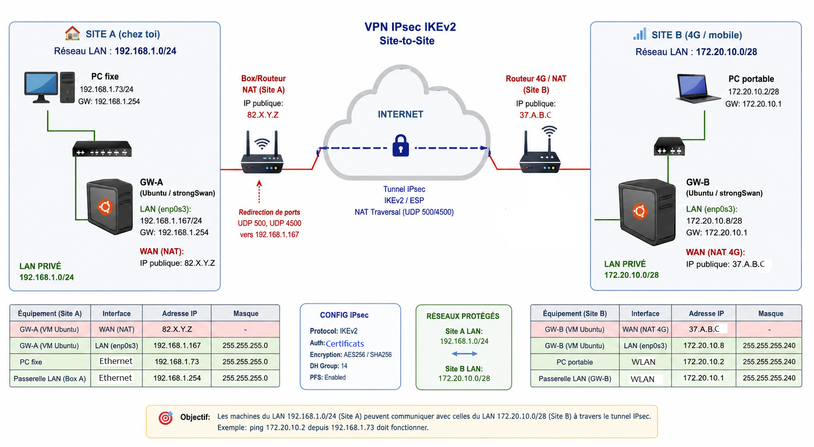
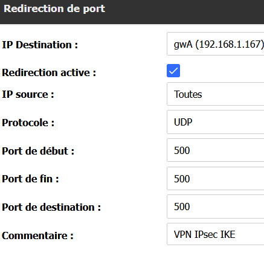
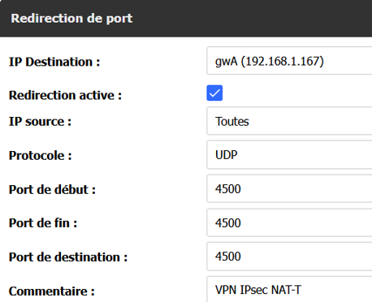
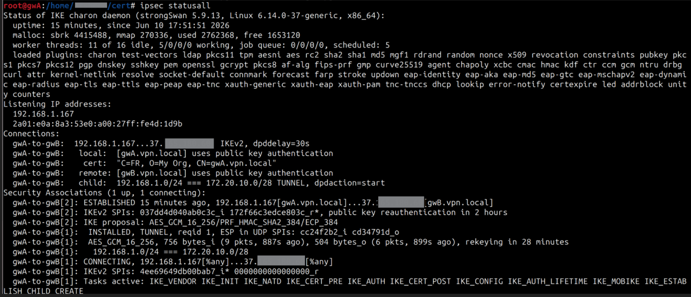

# IPsec VPN Site-to-Site with strongSwan behind NAT

<h1>Introduction to VPN </h1>

A VPN allows you to create a virtual connection between two different local networks. It creates a logical interconnection between local networks over a shared network (whether public, such as the Internet, or private, such as a corporate intranet or a carrier’s backbone) using a traffic segmentation mechanism or a tunnelling protocol. Encryption is possible but not always used.

<h1> Project Objectives </h1>

The project consists of  designing and deploying a secure interconnection between two distinct private LANs (Home and Mobile network behind NAT) while ensuring encrypted LAN-to-LAN communications over the public Internet, through IPsec tunnels.

The infrastructure was deployed in a real-world environment where both VPN gateways were located behind NAT devices and connected through public Internet access (Home LAN ↔ 4G Mobile Network).

<h1> Project Scenario & Network Architecture </h1>

</img>

A secure communication channel was required between 2  private networks connected through the Internet:
- Home LAN network (behind a home router NAT) = LAN A : `192.168.1.0/24` 
- Remote LAN : begind a 4G mobile network) = LAN B : `192.168.1.0/24` 

Both sites were located behind NAT-enabled Internet gateways, introducing  NAT Traversal (NAT-T) constraints. Since standard ESP packets (IP Protocol 50) often get dropped by NAT devices because they lack port information for the NAT to translate. NAT-Traversal (NAT-T) encapsulates the ESP packets inside UDP port 4500, allowing the NAT device to handle them correctly and maintain the session state.


**Main Components** :

- Linux Ubuntu VPN Gateway = GW-A (Site A)
    - VM on VirtualBox 
    - Connected to the home local router/box  (behind a NAT)
    - LAN local : `192.168.1.0/24`
    - Private IP (GW-A) : `192.168.1.167`
    - Public IP (box IP) : `82.X.Y.Z`
 - Linux Ubuntu VPN Gateway = GW-B (Site B)
    - Connected to a 4G mobile network (behind a NAT)
    - LAN local : `172.20.10.0/28`
    - Private IP (GW-A) : `172.20.10.8`
    - Public IP (box IP) : `37.A.B.C`
- Home LAN network (behind my local home router where i have access on it)
- Remote LAN over 4G mobile access (not access to the local router)
- NAT-enabled Internet gateways
- Public Internet connectivity


This project demonstrates:
- IPsec IKEv2 negotiation
- NAT traversal (NAT‑T)
- PKI certificate generation
- Firewall/NAT configuration
-  strongSwan debugging & verification
- Wireshark analysis (before/after IPsec)

    
<h1> Solution </h1>
The following technologies and mechanisms were implemented:

- Deployment of an IPsec IKEv2 Site-to-Site VPN using strongswan
- Ubuntu gateways used as VPN routers
- ESP encryption using AES256-GCM
- NAT Traversal (NAT-T) implementation for VPN communication through NAT devices
- LAN-to-LAN routing between remote private subnets
- Initial PSK authentication then PKI/X.509 authentication
- Traffic analysis tools : `tcpdump`, Wireshark, `ip xfrm`, `ipsec status`
- Security Association (SA) verification
- Validation of encrypted traffic over public Internet


<h1> Key Features </h1> 
<ul>
    <li>IPsec IKEv2 VPN</li>
    <li>ESP tunnel encryption</li>
    <li>NAT Traversal (NAT-T)</li>
    <li>Secure LAN-to-LAN communication</li>
    <li>PKI / X.509 certificate authentication</li>
</ul>


<h1> ⚙️ Configuration Details (GW-A & GW-B) </h1>

Each VPN gateway has been configured to establish the tunnel securely. Below are the IPsec configuration files associated with each VM Ubuntu (Linux) :

[Main Configuration (GW-A)](config/GW-A/ipsec.conf)

[Secret configuration (GW-A)](config/GW-A/ipsec.secrets)

[Secret Configuration (GW-B)](config/GW-B/ipsec.conf)

[Main Configuration (GW-B)](config/GW-B/ipsec.secrets)

<h1> Implementation of the features  </h1>

<h2> Authentification Method  </h2>

<h3> 1. Authentication via PSK   </h3>
First implementation of IPsec tunnel with pre-shared key (PSK)
- definition the authentication method of strongswan with the option `authby=psk`
- Definition of the PSK value in the `/etc/ipsec.secrets`
    Format : `@IP-local-leftid    @IP-local-rightid : PSK "key-value"`

<h3> 2. PKI / Certificate‑Based Authentication (recommanded & used here) </h3>

The ideal authentication solution to use for implementing IPsec tunnel is using X.509 certificates instead of pSK. This significantly improves security by ensuring that each gateway proves its identity using a chain of trust.

Certificates will be generated by the PKI tools `ipsec pki`.

The full PKI setup (CA creation, key generation, certificate signing, installation steps) is documented here:

[Authentication via pKI certificate](pki-certificate-authentication.md)

<h2> StrongSwan Configuration - Secret configuration file "ipsec.secrets" </h2>

The path of the local RSA private key of each gateway GW-X (generated in the PKI setup in the previous step) must be specified in the  `/etc/ipsec.secrets` file with the following format : 

`: RSA gwX-key.pem`

<h2> StrongSwan Configuration - Main configuration file "ipsec.conf"  </h2>

<h3> General Configuration Overview   </h3>

Both gateways (GW-A and GW-B) defines:

- Authentication: `authby=pubkey` → strongSwan uses certificates
- Keys Negociation & management protocol : `keyexchange=ikev2`: IPsec use  for its robust NAT-Traversal capabilities and improved efficiency over IKEv1.
- IKE/ESP suites →  define the cryptographic algorithms for IKE SA and ESP SA,  + SHA‑384 + ECDH P‑384
    - ike : `aes256gcm16-sha384-ecp384` →  IKEv2 with  AES‑GCM + SHA‑384 + ECDH P‑384
    - esp : `aes256gcm16-sha384!` →  ESP with  AES‑GCM + SHA‑384 
- auto :  `start`  → start the IPsec connection and load the IPsec configuration
- DPD: `restart` → restart the tunnel if the peer becomes unreachable

<h3> GW-A Configuration Overview   </h3>

- Local identity: `leftid=gwA.vpn.local` → must match the GW‑A’s certificate CN/SAN.
- Local certificate: `leftcert=gwA-cert.pem` → loads the GW‑A’s certificate and private key.
- Local LAN: `leftsubnet=192.168.1.0/24` → the GW-A's LAN network
- Remote identity: `rightid=gwB.vpn.local` → must match GW‑B’s certificate CN/SAN.
- Remote LAN: `rightsubnet=172.20.10.0/28` → the GW-B's LAN network
- Remote peer IP: `right=37.A.B.C`   → the GW-A peer's public IP

<h3> GW-B Configuration Overview   </h3>

- Local identity: `leftid=gwB.vpn.local` → must match GW‑B’s certificate CN/SAN.
- Local certificate: `leftcert=gwB-cert.pem` → loads the GW‑B’s  certificate and private key.
- Local LAN: `leftsubnet=172.20.10.0/28`  → the GW-B's LAN network
- Remote identity: `rightid=gwA.vpn.local`  → must match the GW-A's certificate CN/SAN.
- Remote LAN: `rightsubnet=192.168.1.0/24`  → the GW-A's LAN network
- Remote peer IP: `right=82.X.Y.Z`  → the GW-B peer's public IP

<h2> Firewall & NAT configuration </h2>
To allow the IKEv2 tunnel to establish across public Internet connections (behind NAT), we must permit specific traffic through the local firewall and configure port forwarding on the internet routers (box).

- IPsec uses IKEv2 protocol (UDP port 500) for ensuring the management & distributions of the keys during IPsec negociation phase. Consequently, ESP encapsulation in UDP/500 is required
- The project include a real-world scenario where both gateways are behind NAT. IPsec deals with NAT by using NAT-T (UDP 4500 port). So ESP encapsulation in UDP/4500 is also required.
 
<h3> Firewall Rules (UFW) </h3>

On both GW-A and GW-B, we must allow IKE and NAT-Traversal traffic. 
```console
# ufw allow 500/udp
# ufw allow 4500/udp
```

<h3> Port Forwarding (NAT-Traversal) </h3>
Because the gateways are behind a NAT device (Home router), incoming VPN packets ( IKE and NAT‑T packets) from the Internet must be forwarded to the internal IP of the gateway VM.
Since GW‑A is behind a home NAT, the router must forward IPsec traffic to the Ubuntu gateway. 

On the router’s admin interface (`192.168.1.254`),  configure a port redirection for each type of traffic : 





<h2> Inter-network Routing </h2>
By default, Linux kernels are configured as end-hosts and do not forward packets between interfaces. To function as a VPN Gateway, we must enable IP forwarding and disable ICMP redirects to enhance security and stability. 

This will allow the gateway to route traffic between the local LAN and the IPsec tunnel (`192.168.1.0 /24` and `172.20.10.0 /28`).

This setting must be persistent across reboots.
 
- Add the following lines to /etc/sysctl.conf : 
```bash
net.ipv4.ip_forward=1
```

- Then, to make the configuration effective immediately without rebooting, run
```console
# sysctl -p
```

<h1>  Validation </h1>

Validate the tunnel using:
- `ipsec statusall`


](assets/verifs/ipsec_statusall_gwB.png)

- `ip xfrm state`
- `ip xfrm policy`
- journalctl for strongSwan logs


### Connectivity Verification

Connectivity Tests
- Ping between gateways
- Ping between LAN hosts
- Route insertion in table 220
To verify the routing and the tunnel, we analyze the XFRM policies:
```bash
$ sudo ip route list table 220
```
- **Routing:** Policy-based IPsec with automatic routing injection in table `220`.

- NAT rules for LAN‑to‑LAN communication

<h1> Connectivity & Troubleshooting </h1>
During testing, hosts from LAN B (172.20.10.0/28), of which GW-B, could not reach hosts in LAN A (192.168.1.0/24), even though the IPsec tunnel was fully established and GW-B ping GW-A.

<h3>  Root Cause </h3>
GW‑A was not performing NAT on traffic coming from LAN B and exiting through its WAN interface (enp0s3).
Because of this, return traffic from LAN A had no route back to the original LAN B host.

When traffic from the LAN-B reaches the local machine, the machine may not have a route back to the source network. We use iptables to perform source NAT (Masquerading), making the traffic appear as if it originates from the gateway itself.

<h3> Fix: Add a MASQUERADE Rule on GW‑A </h3>

``` console
# iptables -t nat -A POSTROUTING -s 172.20.10.0/28 -o enp0s3 -j MASQUERADE
```
Meaning : “Any packet coming from LAN B (172.20.10.0/28) and leaving GW‑A through enp0s3 will have its source IP replaced by GW‑A’s own IP.”

This ensures that:
- return traffic from LAN A is correctly routed back to GW‑A
- GW‑A can then forward it through the IPsec tunnel to LAN B

<h3> Verification </h3>
After applying this rule:
- LAN B → LAN A communication works
- LAN A → LAN B communication works

The tunnel behaves as a full site‑to‑site VPN

# Monitor traffic leaving the gateway interface
sudo tcpdump -ni enp0s3 icmp
    
<h1> Traffic analysis via Wireshark </h1>
Using Wireshark, we observed the transition from plain-text ICMP to encrypted ESP packets crossing the public Internet.


**Before IPsec (cleartext ICMP)**
LAN capture:
before_ipsec_icmp_gwA-lan.png

WAN capture:
before_ipsec_icmp_gwA-wan.png

**After IPsec (ESP encrypted)**

WAN capture:
after_ipsec_esp_gwA-wan.png

LAN capture (still cleartext):
after_ipsec_icmp_gwA-lan.png

<h1> Achivements & Proven skills  </h1>
<ul>
    <li> Configuring  a VPN site-to-site IPsec using strongSwan</li>
    <li> Understanding the IPsec features</li>
    <ul> 
        <li>IKEv2 phases  (Main Mode + Quick Mode), that manages peer authentication (verifying the identity of the gateways using certificates) </li>
        <li>ESP, that provide data confidentiality, integrity and origin authentication  </li>
        <li>NAT Traversal (NAT-T) </li>
    </ul>
    <li>Setting up PKI & X.509 certificats</li>
    <li>Setting up firewalls & routing rules </li>
    <li> IPsec diagnostics </li>
    <li> Network analysis (Wireshark) </li>
</ul>

<h1> Requirements </h1>
To reproduce this project, you will require to have the following environments :

- **OS:** Ubuntu 22.04 LTS (VMs on VirtualBox), connected to the local LAN via the bridge mode (network mode)
- **VPN Software:** strongSwan
- **Networking Tools:** `iproute2`, `iptables`, `tcpdump`, Wireshark
- Management access to (at least) one NAT-enabled router
- Internet connectivity
- Two distinct LAN networks

<h1> 📚 Resources & Useful Links </h1>

Here are the community resources (articles & reference tutorial) that served as the basis for the design and troubleshooting of this architecture:
  * [Setup a Site to Site IPsec VPN with Strongswan and PreShared Key Authentication](https://ruan.dev/blog/2018/02/11/setup-a-site-to-site-ipsec-vpn-with-strongswan-and-preshared-key-authentication)
  * [Configuring Site-to-Site IPSec VPN on Ubuntu using Strongswan](https://gist.github.com/Horat1us/38b712d65fd11abdab23347eca41b9fb) 
  * [Décortiquer IPsec avec strongSwan sur Debian](https://www.thibautprobst.fr/posts/ipsec/) – Understanding the Theoretical Workings of IPsec and NAT-T + Practical Example
  * [How to Install and Configure IPsec VPN with StrongSwan on Ubuntu 22.04](https://wiki.crowncloud.net/?How_to_Install_and_Configure_IPsec_VPN_with_StrongSwan_on_Ubuntu_22_04) – Command references for generating certificates and key pairs
