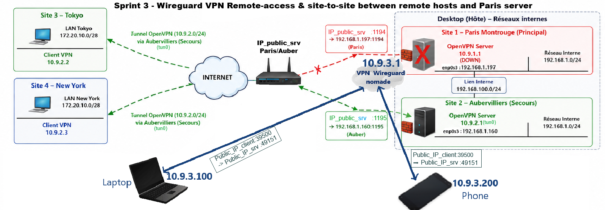

# Site-to-Site VPN via OpenVPN & Remote-Access VPN via Wireguard with Failover Automation

Micro-project reproducing a realistic enterprise VPN architecture  with primary and backup sites, automatic failover, inter-LAN routing and remote access VPN.

##  Introduction
This project simulates a real service delivery scenario in which remote offices and nomad users must securely connect to a resilient infrastructure.

The architecture includes:
- A primary site (Paris-Montrouge)
- A disaster recovery site (Aubervilliers)
- Two remote branches (Tokyo and New York)
- A WireGuard VPN gateway for mobile users
- Automatic failover mechanisms
- Inter-LAN communications and routing

Service delivery context for connecting remote offices (Tokyo, New York) to a resilient network core (Paris, Aubervilliers) and securing access for mobile staff (Nomads).

##  Global Objectives  

### Objective 1. Build Site-to-Site VPNs with OpenVPN**:
- Connect Tokyo and New York sites to the central infrastructure.
- Implement a secure connexion using TLS authentication with X.509 certificates.
- Route traffic between remote LANs.
- Enable full LAN-to-LAN communication.
- Configure IP forwarding and NAT.
- Simulate WAN access through port forwarding.
- Implement a disaster recovery site (Aubervilliers).
 -Automate failover when the primary server becomes unavailable.

**Objective 2. Deploy Remote Access VPN with WireGuard**:
Provide secure access for nomad users (Laptop & Smartphone)

**Features**:
- Public/private key authentication
- Lightweight VPN tunnel
- Access to all internal networks
- NAT and forwarding configuration
- Backup WireGuard server
- Automatic failover

##  Architecture 

Simulation réaliste derrière une Box Internet. Gestion du NAT/PAT, redirection de ports asymétriques (32768 -> 1194 et 32769 -> 1195).

### Global Architecture

*Sprint 1 - Deployment of an OpenVPN site-to-site between Paris Server and Tokyo/NY clients*

Sprint 2 - Deployment of a Secondary OpenVPN Backup Site & Automated Network Failover*

*Sprint 3 -  Deployment of WireGuard Remote Access VPN for connecting nomade hosts (PC, phone) to the primary site (Server Paris)*

*[Bonus] Sprint 4 - Deployment of a Secondary Wireguard VPN Backup (Server Auber) & Automated Network Failover*

## Repository Structure
vpn-openvpn-wireguard-engineering-project/
│
│
├── docs/
│   ├── 01-sprint1-openvpn-site-to-site-paris.md
│   ├── 02-sprint2-openvpn-backup-auber-failover-automation.md
│   ├── 03-sprint3-wireguard-nomade.md
│   └── 04-sprint4-wireguard-backup-failover.md
│
├── configs/
│   ├── openvpn/
│   ├── wireguard/
│   
│
├── scripts/
│   ├── failover.sh
│
├── diagrams/
│
├── assets/
│   ├── captures-wireshark/
│   ├── verifs/
│
└── README.md

**Brief description of the main folders**
-  `docs/` : sprints with a README.md file/sprint, which will serve as a recipe book / test report to validate the procedures.
- `01-sprint1-openvpn-site-to-site-paris.md`
- `02-sprint2-openvpn-backup-auber-failover-automation.md` : 
- `03-sprint3-wireguard-nomade.md`  
- `04-script4-wireguar-backup-auber-failover-automation-paris.md`  

- `configs/` : files .conf of OpenVPN and Wireguard + files ccd
- `diagrams/` : Schemas/topologies
- `assets/` : Test results (Wireshark, pings, tracerouten ...)
   - `captures-wireshark/` :  Packet analysis captures via Wireshark
   - `verifs/` :  Test capture of e ping/http
- `scripts/`:  Failover, tests, monitoring

## Structure of each Sprint Documentation 
Each sprint follows the same structure:
- Objectives
- Architecture
- Configuration
- Routing
- Tests performed
- Results obtained
- Troubleshooting

## Testing and Acceptance
Summary of tests performed (ping, traceroute, HTTP via tunnel), location of traces, and how to reproduce them.

##  Troubleshooting 
Detailed troubleshooting for each sprint is available:
➡️ [Troubleshooting Sprint 1](docs/01-sprint1-openvpn-site-to-site-paris.md#8troubleshooting--fixes)
➡️ [Troubleshooting Sprint 2](docs/02-sprint2-openvpn-backup-auber-failover-automation.md#-10-troubleshooting)
➡️ [Troubleshooting Sprint 3](docs/03-sprint3-wireguard-nomade.md#%EF%B8%8F-9-troubleshooting)
➡️ [Troubleshooting Sprint 4](docs/04-script4-wireguar-backup-auber-failover-automation-paris.md#10-troubleshooting)

## Skills Demonstrated
### Networking
   - Routing
   - Static routes
   - IP forwarding
   - NAT/PAT
   - Linux networking

### VPN Technologies
   - OpenVPN
   - WireGuard
   - TLS/X.509 PKI
   - High availability

### Linux Administration
   - systemd
   - iptables
   - cron
   - tcpdump
   - sysctl

### Troubleshooting
   - Wireshark
   - Packet analysis
   - Route debugging
   - Service monitoring
   - Failure simulation

## Technologies used:
- OpenVPN (site-to-site) 
- WireGuard (remote access & site-to-site) 
- OpenSSL, TLS / X.509 PKI
- Linux Routing
- iptables
- Wireshark
- Ubuntu Linux
- Bash scripting
- systemd

## Achievements / Realizations : </h2>

- Designed and implemented a multi-site VPN infrastructure using OpenVPN and WireGuard.
- Connected several remote sites (Tokyo, New York, Paris, Aubervilliers) through routed VPN tunnels secured with TLS certificates.
- Implemented disaster recovery mechanisms and automatic failover.
- Configured inter-LAN routing, NAT & firewall policies.
- Automated network recovery using shell scripts and cron.
- Performed packet-level troubleshooting with Wireshark and tcpdump
- Validated connectivity using ICMP, HTTP and traceroute tests
- Simulated production incidents and recovery scenarios, ensuring resiliency.
