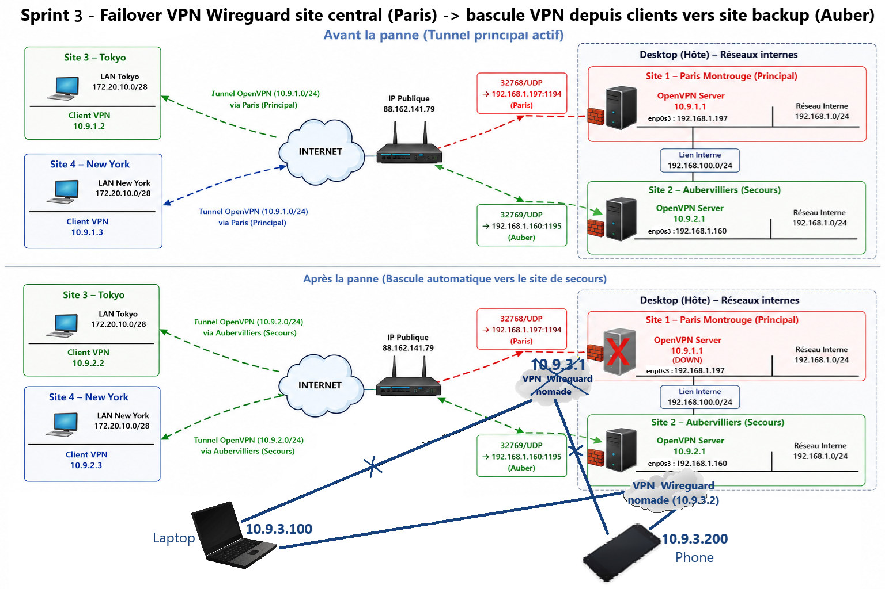

# Site-to-Site VPN via OpenVPN & Remote-Access VPN via Wireguard with Failover Automation / Backup 

Micro-project reproducing a realistic enterprise VPN architecture.

##  Introduction

Service delivery context for connecting remote offices (Tokyo, New York) to a resilient network core (Paris, Aubervilliers) and securing access for mobile staff (Nomads).

<h3> Technologies used:  </h3>

- OpenVPN (site-to-site) Robustesse/Routage complexe)
- WireGuard (remote access) (Performance Nomade
- TLS / X.509 PKI
- Linux Routing
- iptables
- Wireshark
- Apache2
- iptables (Sécurisation hardening).

##  Global Objectives  

**Objective 1. Build Site-to-Site tunnels with OpenVPN**:
   - Connect the **Tokyo** and **New York** branches to the central sites in **Paris-Montrouge** and **Aubervilliers**.
   - Implement secure TLS authentication using **SSL/TLS certificates** 
   - Route traffic between remote offices  / Configure **static routes** and **iroute** for routing between local networks.
   - - Configure a disaster recovery site via **automatic failover** to Aubervilliers if Paris goes down.

**Objective 2. Deploy a remote access (mobile) VPN with WireGuard**:
   - Enable a **mobile PC** or a **smartphone** to connect to the central servers.
   - Use **public/private keys** for a lightweight and fast connection.
   - Configure **NAT** and **forwarding** to access the Internet via the VPN.
- Implement VPN failover

##  Architecture 
Hybride On-Premise : Simulation réaliste derrière une Box Internet. Gestion du NAT/PAT, redirection de ports asymétriques (32768 -> 1194 et 32769 -> 1195).

### Global Architecture / Schemas

*Sprint 1 - Deployment of an OpenVPN site-to-site between Paris Server and Tokyo/NY clients*

Sprint 2 - Deployment of a Secondary OpenVPN Backup Site & Automated Network Failover*

*Sprint 3 -  Deployment of WireGuard Remote Access VPN for connecting nomade hosts (PC, phone) to the primary site (Server Paris)*

*[Bonus] Sprint 4 - Deployment of a Secondary Wireguard VPN Backup (Server Auber) & Automated Network Failover*

## Directory Structure
Brief description of the main folders.
-  `docs/` : sprints with a README.md file/sprint, which will serve as a recipe book / test report to validate the procedures.
- `01-sprint1-openvpn-site-to-site-paris.md`  : Détail step 1 - 
- `02-sprint2-openvpn-backup-auber-failover-automation.md` : Détail step 2 - 
- `03-sprint3-wireguard-nomade.md`  : Détail step 3 - VPN nomade
- `04-script4-wireguar-backup-auber-failover-automation-paris.md`  : Step 4 -

- `configs/` : files .conf of OpenVPN and Wireguard + files ccd
- `diagrams/` : Schemas, exigences, topologies
- `assets/` : Test results (Wireshark, pings)
   - `captures-wireshark/` :  Captures des analyses de paquets sur Wireshark
   - `verifs/` :  Captures des tests de ping/http
- `scripts/`:  Failover, tests, monitoring

## Structure of sprint.md file

The structure of each 0Y-sprintX.md file in /docs is : 
- Sprint objective
- Architecture & Overview
- Configurations
- Tests carried out
- Results obtained
- Troubleshooting : Problems encountered in this specific sprint and solution implemented

## Procédure de déploiement (How-to)
<!--
Donne les commandes clés pour que quelqu'un puisse reproduire ton infrastructure :
    Activer le packet forwarding IP.
    ports to forward (32768 -> 1194, 32769 -> 1194)

    Générer les configurations serveurs/clients.
    Lancer le script de pare-feu.

-->

## Security & Implémentation du Hardening Réseau
<!--
Reminder about not committing private keys and the procedure for obtaining certificates.

Explique précisément comment tu as sécurisé le Cas 3.
    Mise en place de la politique restrictive par défaut à DROP partout (INPUT & FORWARD).
    Présentation du script de "Défense en profondeur" (Whitelisting SSH port 22, ports OpenVPN, et ouverture complète mais cloisonnée de l'interface de liaison privée ens5).
-->

## Testing and Acceptance
Summary of tests performed (ping, traceroute, HTTP via tunnel), location of traces, and how to reproduce them.

##  Troubleshooting & Debugging 

A local troubleshooting is available here:
➡️ [Troubleshooting Sprint 1](docs/01-sprint1-openvpn-site-to-site-paris.md)
➡️ [Troubleshooting Sprint 2](docs/02-sprint2-openvpn-backup-auber-failover-automation.md)
➡️ [Troubleshooting Sprint 3](docs/03-sprint3-wireguard-nomade.md)
➡️ [Troubleshooting Sprint 4](docs/04-script4-wireguar-backup-auber-failover-automation-paris.md)

A more general troubleshooting guide (routing issues, NAT, MTU, OpenVPN logs, WireGuard handshake, failover debugging, etc.) is available here:
➡️ [Troubleshooting Guide](docs/troubleshooting.md)

<h2> Achievements & Realizations : </h2>

- Designed and implemented a multi-site VPN infrastructure using OpenVPN (TLS/X.509)
- Connected multiple remote sites (Tokyo, New York, Paris, Aubervilliers)
- Implemented disaster recovery and VPN failover mechanisms
- Configured WireGuard remote-access VPN for nomad users
- Managed Linux routing, static routes, NAT and firewall policies
- Performed packet-level troubleshooting using Wireshark and tcpdump
- Validated connectivity through ICMP, HTTP and traceroute testing
- Simulated production incidents and recovery scenarios

## Contact
Author, date, project version.
