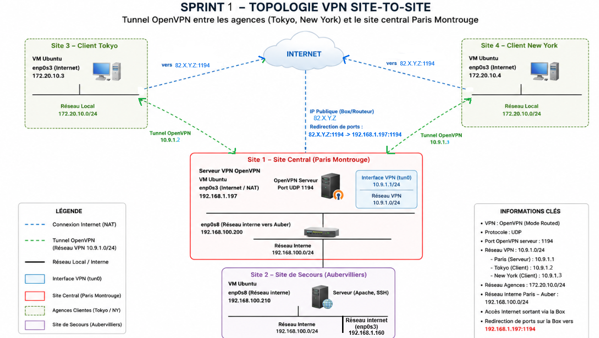
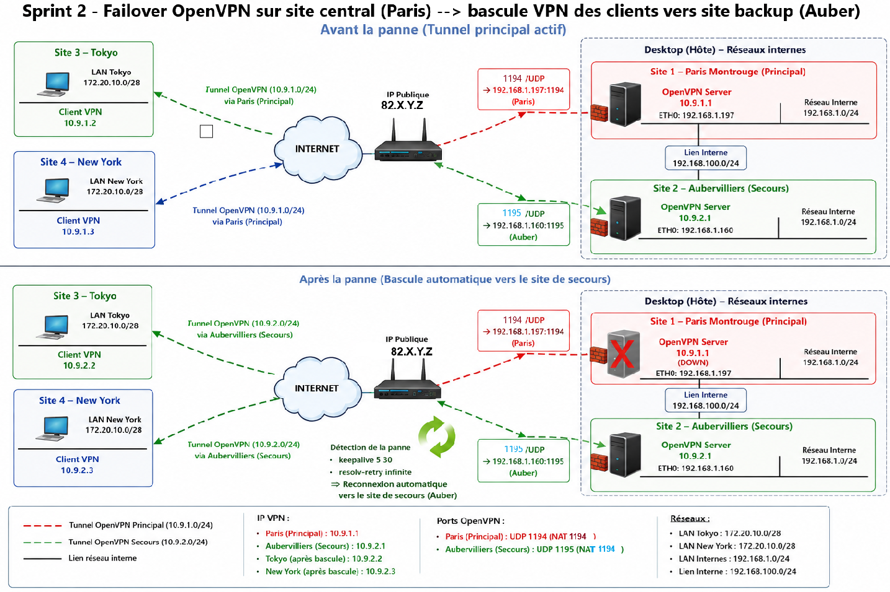
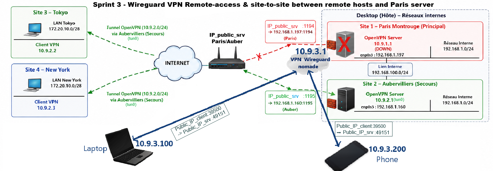
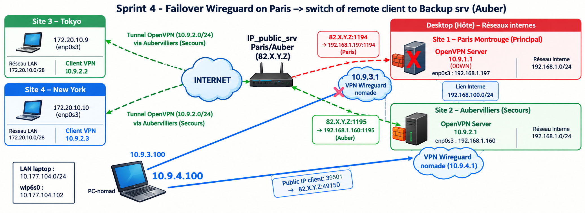

# Site-to-Site VPN via OpenVPN/Wireguard & Remote-Access VPN via Wireguard with Failover Automation

Micro-project reproducing a realistic enterprise VPN architecture  with primary and backup sites, automatic failover, inter-LAN routing and remote access VPN.

##  Introduction
This project simulates a real service delivery scenario in which remote offices and nomad users must securely connect to a resilient infrastructure.

The architecture includes:
- A primary site (Paris-Montrouge)
- A disaster recovery site (Aubervilliers)
- Two remote branches (Tokyo and New York)
- A WireGuard VPN gateway for mobile users
- Automatic failover mechanisms
- Inter-LAN communications and routing

Service delivery context for connecting remote offices (Tokyo, New York) to a resilient network core (Paris, Aubervilliers) and securing access for mobile staff (Nomads).

##  Global Objectives  

### Objective 1 - Build Site-to-Site VPNs with OpenVPN
- Connect Tokyo and New York sites to the central infrastructure.
- Implement a secure connexion using TLS authentication with X.509 certificates.
- Route traffic between remote LANs.
- Enable full LAN-to-LAN communication.
- Configure IP forwarding and NAT.
- Simulate WAN access through port forwarding.
- Implement a disaster recovery site (Aubervilliers).
- Automate failover when the primary server becomes unavailable.

### Objective 2 - Deploy Remote Access & site-to-site VPN with WireGuard
Provide secure access for nomad users (Laptop & Smartphone)

**Features**:
- Public/private key authentication
- Lightweight VPN tunnel
- Access to all internal networks
- NAT and forwarding configuration
- Backup WireGuard server
- Automatic failover

## Network Topology & Architecture

### Sprint 1 – Deployment of a site-to-site OpenVPN tunnel between the primary server (Paris) and Tokyo/NY clients 
- Paris-Montrouge acts as the main VPN server.
- Tokyo and New York establish routed VPN tunnels with the main server using SSL/TLS for the authentication & encryption of data.



---

### Sprint 2 – Deployment of a secondary OpenVPN backup server (Aubervilliers) with an Automated Network Failover, when incident happens on the primary server 
Aubervilliers acts as the disaster recovery site.

**Features:**
- Multiple remote statements
- Automatic reconnection
- Dynamic route switching
- failover script automatically executed via system-timers



---

### Sprint 3 – Deployment of a WireGuard Remote Access VPN that connects nomad hosts (PC, phone) to the primary server (Paris)
Primary WireGuard server on Paris.

Provides:
- Access to Paris LAN
- Access to Tokyo/New York LAN
- Inter-site communication through OpenVPN



---

### Sprint 4 (Bonus) –  Deployment of a Secondary Wireguard VPN Backup that connects nomad host to a backup server (Auber) via an Automated Network Failover when incident happens on the primary server 
Secondary WireGuard server on Aubervilliers.

Features:
- Redundant VPN gateway
- Automatic reconnection
- Backup routing
- High availability



## Repository Structure
```text
vpn-openvpn-wireguard-engineering-project/
│
│
├── docs/
│   ├── 01-sprint1-openvpn-site-to-site-paris.md
│   ├── 02-sprint2-openvpn-backup-auber-failover-automation.md
│   ├── 03-sprint3-wireguard-nomade-site-to-site.md
│   └── 04-sprint4-wireguard-backup-failover.md
│   └── pki-certificate-authentication.md
│
├── configs/
│   ├── openvpn/
│   ├── wireguard/
│   
│
├── scripts/
│   ├── openvpn-failover.sh
│   ├── wg-failover-auber
│   ├── wg-failover-pc.sh
│
├── diagrams/
│
├── assets/
│   ├── verifs/
│   ├── wireshark/
│
└── README.md
```
**Brief description of the main folders**
-  `docs/` : sprints with a README.md file/sprint, which will serve as a recipe book / test report to validate the procedures.
- `01-sprint1-openvpn-site-to-site-paris.md`
- `03-sprint3-wireguard-nomade-site-to-site.md` 
- `03-sprint3-wireguard-nomade.md`  
- `04-script4-wireguar-backup-auber-failover-automation-paris.md`  

- `configs/` : files .conf of OpenVPN and Wireguard + files ccd
- `diagrams/` : Schemas/topologies
- `assets/` : Test results (Wireshark, pings, traceroutes ...)
   - `wireshark/` :  Packet analysis captures via Wireshark
   - `verifs/` :  Test capture of e ping/http
- `scripts/`:  Failover, tests, monitoring


## Structure of each Sprint Documentation 
Each sprint follows the same structure:
- Objectives
- Architecture
- 
- Configuration
- Routing
- Tests performed
- Results obtained
- Troubleshooting

## Testing and Acceptance
Summary of tests performed (ping, traceroute, HTTP via tunnel), location of traces, and how to reproduce them.

##  Troubleshooting 
Detailed troubleshooting for each sprint is available:
➡️ [Troubleshooting Sprint 1](docs/01-sprint1-openvpn-site-to-site-paris.md#8troubleshooting--fixes)
➡️ [Troubleshooting Sprint 2](docs/02-sprint2-openvpn-backup-auber-failover-automation.md#-10-troubleshooting)
➡️ [Troubleshooting Sprint 3](docs/03-sprint3-wireguard-nomade.md#%EF%B8%8F-9-troubleshooting)
➡️ [Troubleshooting Sprint 4](docs/04-script4-wireguar-backup-auber-failover-automation-paris.md#10-troubleshooting)

## Skills Demonstrated & Technologies used

### Networking 
- IP forwarding
- Linux networking/routing
- Inter-LAN routing
   - Static routes
   - CCD files & iroute statements (OpenVPN configuration)
   - Route metrics
   - Dynamic route replacement

### Security
- Authentication via :
     - public/private keys
     - X.509/SSL certificates (PKI infrastructure)
 
- firewall rules via iptables :
     - MASQUERADE NAT
     - POSTROUTING rules
 - firewall rules via Windows defender

- Port forwarding (router Freebox)
- ufw (for allowing incoming OpenVPN/Wireguard/HTTP traffic)

### VPN Technologies
   - OpenVPN  (site-to-site VPN) 
   - WireGuard (remote access VPN & site-to-site VPN)


### Linux Administration
   - iptables
   - tcpdump
   - sysctl
   - systemd
- Wireshark
- Bash scripting
- systemd (service manager)

### Troubleshooting
   - ICMP, traceroute, HTTP tests
   - Wireshark packet captures & analysis
   - Route debugging
   - Service monitoring
   - Service Failure simulation

## Final Achievements

- Design and implementation of a VPN infrastructure between multi-site using OpenVPN and WireGuard.
- Connection of  several remote sites (Tokyo, New York, Paris, Aubervilliers) through routed VPN tunnels secured with SSL/TLS.
- Configuration of inter-LAN routing, IP forwarding, NAT Masquerade rule & firewall policies.
- Implementation of disaster recovery mechanisms and automatic failover / automated network recovery using shell scripts and systemd.
=> Simulation of production incidents and recovery scenarios, ensuring resiliency.
- Performed packet-level troubleshooting with Wireshark and tcpdump
- Validated connectivity using ICMP, HTTP and traceroute tests
