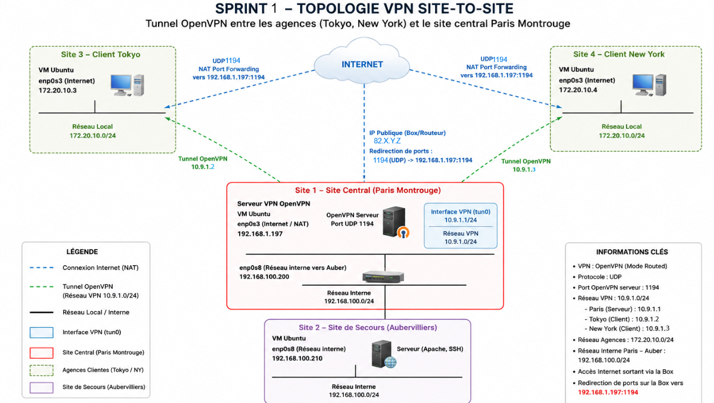

<h1> 🏁 Sprint 1 - OpenVPN site-to-site with Paris server and Tokyo/NY clients </h1>

## Sprint Objectives
- Deploy OpenVPN on  the primary server site (Paris Montrouge) 
- Connect Tokyo & New York clients to the central site via an unsecured network (Internet)
- Check routing and inter-site communication

## Architecture & Topology overview



### Addressing Architecture
  * **Public/WAN IP Paris / Auber** : `82.X.Y.Z`
  * **Public/WAN IP Tokyo / NY** : `37.B.C.D`
  * **Paris Site/Server (Paris)**:
      - Private LAN IP : `192.168.1.197`
      - Inter-site Paris-Auber link IP: `192.168.100.200`
  * **Tokyo Site/Client**:  Private LAN IP  `172.20.10.3`
  * **New York Site/Client**: Private LAN IP `172.20.10.4`
  * **Backup Site (Aubervilliers)** (No active tunnel at this stage) :
      - Physical LAN IP : `192.168.1.197`
      - Inter-site Auber-Paris : `192.168.100.210`

### Primary  Site Role (Paris-Montrouge)
- Paris acts as the primary VPN hub.
- Must be reachable by both Tokyo and New York
 
### Tunnel VPN Network
- Primary tunnel (tun0) : `10.9.1.0/24` (Paris)
   - Primary Site IP (Paris) : `10.9.1.1`
   - Client Tokyo IP : `10.9.1.2`
   - Client NY IP : `10.9.1.3`


## Technical Specifications
* **Protocol**: OpenVPN (VPN SSL/TLS) over UDP transport layer.
* **Security**: Strong authentication via public key infrastructure (X.509 PKI) and asymmetric encryption for key exchange (2048-bit Diffie-Hellman).

## 1. PKI Setup 
The ideal authentication solution to use for implementing an OpenVPN tunnel is using X.509 certificates. This significantly improves security by ensuring that each peer/entity (here the servers and the clients) proves its identity using a chain of trust.

Certificates will be generated by the PKI tools openssl.

The full PKI setup (CA creation, key generation, certificate signing, installation steps) is documented here:
[Authentication via SSL/TLS certificates](pki-certificate-authentication.md)

## 🔧 2. OpenVPN Configuration 

*Full configuration files are available in the root folder  `configs/openvpn/` directory.*

### Paris Server - Key OpenVPN Directives

- `server 10.9.1.0 255.255.255.0` - Defines the primary VPN tunnel network, that will be used by server/client(s)
- `client-config-dir /etc/openvpn/ccd` - Enables per-client static IP assignment and iroute.
- `client-to-client` - Allows VPN clients to communicate with each other.
- `port 1194` - server listening port

**Server TLS authentication**
- `ca` -  the CA certificate used to validate the server’s identity.
- `cert` - server certificate signed by the CA. 
- `key` -  Private key of the server.
- `dh` -
- `tls-server` - this configuration is for a TLS server

### Static VPN IP Assignment (CCD)
In the CCD configuration files, add a static VPN IP to each client: 
   * `/etc/openvpn/ccd/client-tokyo`:
       ```text
       ifconfig-push 10.9.1.2 255.255.255.0
       ```
   * `/etc/openvpn/ccd/client-ny`:
       ```text
       ifconfig-push 10.9.1.3 255.255.255.0
       ```

---

### Clients - Key OpenVPN Directives

- `remote 82.X.Y.Z 1194` - Connection to the Server (WAN/Public IP and port of Paris VPN server)
- `client`- Indicates that this configuration is for a OpenVPN client

**Client TLS authentication using the PKI created in this sprint.**
- `ca` -  the CA certificate used to validate the server’s identity.
- `cert` - client certificate signed by the CA. 
- `key` -  private key of the client
- `tls-client` - this configuration is for a TLS server

---

## 🔀 3. Routing Configuration

###  Server Push Routes
Routes dynamically received by the clients (Tokyo/NY) when connecting to the VPN server.
```
 # openvpn server configuration
push "route 192.168.1.0 255.255.255.0"
push "route 192.168.100.0 255.255.255.0"
```

 
###  Server route 
Declare a dynamic route on Paris to instruct it to route via the VPN tunnel to reach the LAN network of Tokyo: 
```
 # openvpn server configuration
route 172.20.10.0 255.255.255.240
```

### iroute (OpenVPN Internal Routing Table)

*Key Concept of OpenVPN*:
*OpenVPN, when operating in multi‑client mode, implements its own software switching layer. This means it uses two routing tables:*
*- Linux kernel routing table → decides which interface (tun0) the packet should use*
*- OpenVPN internal routing table (iroute) → decides which client the packet must be delivered to*

Even if the Linux kernel knows that a client subnet (ex : 172.20.10.0/28) must be sent through tun0, the OpenVPN daemon still needs to know which client owns this subnet. Without an iroute entry, Linux forwards the packet to tun0 & OpenVPN receives the packet. But OpenVPN does not know which encrypted tunnel corresponds to the subnet  specified. In result, OpenVPN silently drops the packet.

To ensure that the OpenVPN server correctly forwards traffic to the right client, each remote client  must be explicitly mapped to the corresponding client certificate (based on the Common Name (CN)) using CCD entries.

1. In Paris OpenVPN server configuration, enable the CCD : `client-config-dir /etc/openvpn/ccd`

2. Create the CCD configuration files by matching the client certificate CN (filename) then add iroute entries to map each remote LAN IP to the correct client :
   * `/etc/openvpn/ccd/client-tokyo`:
       ```text
       iroute 172.20.10.0 255.255.255.240
       ```
   * `/etc/openvpn/ccd/client-ny`:
       ```text
       iroute 172.20.10.4 255.255.255.255
       ```

*CDD configuration files are available in the root folder  `configs/openvpn/ccd` directory.*

### Routing on Auber
Contains the return route 10.9.1.0/24 via 192.168.100.200 on interface enp0s8.
    
## 🛡️ 4. Firewalling, IP forwarding & NAT Configuration


**IP forwarding (Linux)**
The Linux server is acting as a firewall, router, or NAT device, it will need to be capable of forwarding packets that are meant for other destinations (other than itself). The VPN server needs to route traffic between the VPN clients and your local network or the internet. Without IP forwarding, VPN clients won’t be able to access resources beyond the VPN server itself.

Linux uses the net.ipv4.ip_forward kernel variable to toggle this setting on or off.

**Port Forwarding (home router)**
To enable remote offices (Client Tokyo and NY) to initiate a connection to the central server located behind a home router, a port forwarding rule and local firewall settings have been configured on Paris site. 

- Rule applied: `From everywhere on Internet connecting to external port UDP/1194 ➔ to 192.168.1.197 on internal port 1194`

**Firewall ufw**
- By default, when ufw is activated, all incoming traffic is blocked. So the standard UDP OpenVPN port 1194 was blocked.

OpenVPN UDP traffic must be allowed in the ufw firewall:
```bash
ufw allow 1194/udp
```

## 5. Starting OpenVPN services 
The configuration files are stored in the root folder `configs/openvpn/`. 

They are loaded by:
```bash
# Paris server
systemctl start openvpn@srv-parismont
```

```bash
# Remote clients
systemctl start openvpn@client-tokyo
systemctl start openvpn@client-NY
```

## 6. Web server configuration  

- Installation of nginx service web on auber site

## 7. Validation  / Connectivity ✅

### Ping Tests - Tunnel Connectivity 

- Tokyo → VPN Server Paris (IP `10.9.1.1`) = [Ping OK](../assets/verifs/sprint1/ping-tokyo-paris-vpn.png)
[Capture-Wireshark](../assets/wireshark/openvpn-icmp-ping-tokyo-paris-vpn.png) <!-- A SCREEN -->

**Wireshark Captures - Analysis**
*Here is a summary of the process that happen : 
1. When Tokyo sends a ping to `10.9.1.1`, OpenVPN encapsulates it in an encrypted tunnel and sends it to the WAN IP of VPN Paris Server (`82.X.Y.Z:1194`).
3. The Paris home router forwards the packet to the Paris VPN server on the LAN (`192.168.1.197:1194`).
4. The Paris VPN server decrypts the packet & responds to the ping. The response is encapsulated in OpenVPN to return to Tokyo.

• ICMP Echo Request/Reply packets encapsulated within OpenVPN packets (UDP/1194) are observed between `A.B.C.D` (IP WAN Tokyo) and `82.X.Y.Z` (IP WAN Paris).
• Once decrypted, the ICMP packets appear between `10.9.1.2` (Tokyo) and `10.9.1.1` (Montrouge) inside the tunnel interface.

- VPN Auber → Tokyo VPN (IP `10.9.1.2`) = [Ping OK](../assets/verifs/sprint1/ping-auber-tokyo-vpn-ok.png) 

- VPN Tokyo → NY client (IP `10.9.1.3`) = [Ping OK](../assets/verifs/sprint1/ping-tokyo-ny-vpn.png)
[Capture-Wireshark](../assets/wireshark/icmp-openvpn-ping-tokyo-ny-vpn.png) 

---

### Ping Tests - LAN Access (Paris/Auber) ✅

- Tokyo → Server Paris LAN (IP `192.168.1.197`) = [Ping OK](../assets/verifs/sprint1/ping-tokyo-paris-lan-ok.png)
[Capture-Wireshark](../assets/wireshark/openvpn-icmp-ping-tokyo-paris-lan.png)

- Tokyo →  Auber (internal IP `192.168.100.210`) = [Ping OK](../assets/verifs/sprint1/ping-tokyo-internal-lan-auber-ok.png)
[Capture-Wireshark](../assets/wireshark/openvpn-icmp-ping-tokyo-auber-internal-lan.png)

 ### Ping Tests - LAN Access (Tokyo/NY) ✅

-  Paris → Tokyo (`172.20.10.3`) = [Ping OK](../assets/verifs/sprint1/ping-paris-tokyo-lan-ok.png)

-  Auber → Tokyo (`172.20.10.3`) = [Ping OK](../assets/verifs/sprint1/ping-auber-tokyo-lan.png)
[Capture-Wireshark](../assets/wireshark/openvpn-icmp-ping-auber-tokyo-lan.png)  

---

## 8.Troubleshooting & Fixes

During the acceptance testing phase, several issues of ping were identified and resolved.

---

### ❌ Issue A - Ping fails Tokyo → LAN Paris (192.168.1.197)
- **Symptom**: The tunnel is working (ping `10.9.1.1` OK), but the server’s physical interface cannot be reached.

- **Cause**: The routing table on the Tokyo OS is not aware of the subnet behind Paris (`192.168.1.0/24`) and is sending packets to its default internet gateway.
 
- **Solution** : Addition of the route injection directive to the OpenVPN Paris server configuration:
`push "route 192.168.1.0 255.255.255.0"`

- **Proof & Result** : 
On Tokyo and NY, a route has been added to the Paris LAN via the tunnel.
[Routing Table Tokyo](../assets/verifs/routing-table-NY-before-failover.png) 
[Routing Table NY](../assets/verifs/routing-table-NY-before-failover.png) 

*See [Ping Tests - LAN Access (Paris/Auber)](#ping-tests---lan-access-parisauber-).*

---

### ❌Issue B - Ping fails Tokyo → Auber (192.168.100.210 / 192.168.1.160)

- **Symptom**: Ping requests from Tokyo to the Aubervilliers inter-site interface fail.

- **Causes**:
1) Linux kernel IP forwarding was not enabled in Paris.
2) The OS routing table on the Tokyo is not aware of the subnet behind Paris (`192.168.100.0/24`,  `192.168.1.0/24` ) and is sending packets to its default internet gateway.
3) Aubervilliers does not know where to route ping responses to the `10.9.1.0/24` VPN network. Its routing table is not aware of this VPN network and is sending packets to its default internet gateway.
[Capture Wireshark showing that Auber reply to the VPN IP Tokyo](../assets/wireshark/icmp-ping-reply-auber-tokyo-vpn.png)
      
- **Solutions**:

1) Activation of IP forwarding on the Paris server (`net.ipv4.ip_forward=1`).

2) Addition of the route injection directive to the Paris/Auber's LAN, to the OpenVPN Paris server configuration:
  ```text
      push "route 192.168.100.0 255.255.255.0"
      push "route 192.168.1.0 255.255.255.0’`
  ```

3) Addition of a static route on the Aubervilliers table routing to instruct it to route via Paris to reach the tunnel network:
  ```bash
      ip route add 10.9.1.0/24 via 192.168.100.200 dev enp0s8
   ```

- **Proofs & Results** : 
On Tokyo, a route has been added to the these 2 distant LANs via the tunnel.
[Routing Table Tokyo](../assets/verifs/routing-table-tokyo-before-failover.png)

A traceroute to the Auber internal LAN confirms also the utilization of the VPN tunnel as gw :
[Traceroute-tokyo-to-auber-internal-LAN](../assets/verifs/sprint1/traceroute-tokyo-auber-lans.png)

On Auber, a route has been added to the VPN network via the internal interface Auber-Paris.
[Routing Table Auber](../assets/verifs/sprint1/routing-table-auber-sprint0.png) 

*See [Ping Tests - LAN Access (Paris/Auber)](#ping-tests---lan-access-parisauber-).*

---

### ❌ Issue C - Ping fails Paris → Tokyo (172.20.10.3)  

- **Symptom**: The Linux kernel in Paris does indeed have the system route (`route 172.20.10.0...`), and wireshark shows the packet entering the tun0 interface, but the packet never reaches the Tokyo VM.

- **Causes** :
1) *Analysis & Key Concept of OpenVPN*: OpenVPN in multi-client mode manages its own software switching architecture. The Linux kernel forwards the packet to OpenVPN via tun0, but the OpenVPN application does not know which encrypted tunnel (which client certificate) the `172.20.10.0/28` subnet is attached to. The lack of software mapping results that OpenVPN silently drop the paquet.
2) Paris does not know where to route responses to the `172.20.10.0/24` LAN network (not route to this network in its table routing) so it is sending packets to its default internet gateway.

- **Solutions**:

1) Declare the iroute directive in the specific CCD entry for each client on the Paris server:
   - In CDD OpenVPN file of Tokyo, add `iroute 172.20.10.0 255.255.255.240`
   - In CDD OpenVPN file of NY, add `iroute 172.20.10.4 255.255.255.255`
   
2) Declare a dynamic route on Paris to instruct it to route via the VPN tunnel to reach the LAN network of Tokyo:
   ```route 172.20.10.0 255.255.255.240```

**Proof & Result** : 
On Paris, a route has been added to the Tokyo LAN via the tunnel.
[Routing Table Paris](../assets/verifs/sprint1/routing-table-paris-sprint0.png)

*See [Ping Tests - LAN Access (Tokyo/NY)](#ping-tests---lan-access-tokyony-).*

---

### ❌ Issue D - Ping fails Auber → Tokyo  (172.20.10.3) 
- **Symptom** : From the auber, a ping to a LAN network behind the paris server (e.g. `172.20.10.3/24`) fails.

- **Causes**:
1) Auber doesn't known where to send the ping ; no route to the Tokyo LAN network on Auber.
2) When paris server receives the ping from auber and see that the destination is not itself, it drops the icmp packet. This is due to the forwarding settings that is disabled by default on Linux kernel. (`net.ipv4.ip_forward=0`). The Paris server is not routing VPN → LAN traffic

- **Solution** :
1) Add a static route to the Tokyo LAN network on Auber, that goes via the interface link Auber-Paris
2) Activate Linux IP forwarding on the Paris server.

- **Proof**:
On Auber, a route has been added to the Tokyo LAN network via the internal interface Auber-Paris. 
[Routing Table Auber](../assets/verifs/sprint1/routing-table-auber-sprint0.png)

*See [Ping Tests - LAN Access (Tokyo/NY)](#ping-tests---lan-access-tokyony-).*

---

### ❌ Issue E - Communication from LAN-to-LAN fails 

- **Symptoms** :  client can't ping server's LAN machines, such as the router Paris LAN `192.168.1.254` or physical PC (hypervisor) that hosts the Paris's server  `192.168.1.73`. And Paris server can't ping client's LAN machines, such as the gw server LAN `172.20.10.1` or physical PC (hypervisor) that hosts the client's server  `172.20.10.2`.

- **Causes** : 
1) The LAN hosts (e.g., `172.20.10.0/28` or `192.168.1.0/24`) do not know how to reach the remote LAN behind the VPN tunnel. Without NAT, each LAN host would need a static route: `route add <remote LAN> via <VPN gateway>`. Since these routes are not configured on every LAN machine (just Auber & Paris), replies never return to the tunnel → communication fails.

2) The Windows firewall blocks incoming ICMP requests from anywhere. Indeed, Inbound ICMP (ping) is blocked by default so other machines on the LAN cannot ping the windows machine. (As a contrary, Outbound ICMP (ping) is allowed by default, this is why Windows PC can ping other machines on the LAN.)

- **Solutions**:

1)  Apply a POSTROUTING MASQUERADE NAT rule on both server and clients. This enables the VPN gateway (client or server here) rewrites the source IP of packets coming from the tunnel so that they appear as if they originate from the LAN interface itself.

```bash
iptables -t nat -A POSTROUTING -s 10.9.1.0/24 -o enp0s3 -j MASQUERADE
```

2) enable  Inbound firewall rule `File and Printer Sharing (Echo Request – ICMPv4-In)` for the `Private, Public` Profile, in the *Windows Defender Firewall* of Windows 11, on both Windows computers.
 [Windows Defender Firewall - Inbound firewall rule](../assets/verifs/sprint1/inbound-rule-firewall.png)

- **Proof** :
Tokyo → Windows PC server = [Ping OK](../assets/verifs/sprint1/ping-tokyo-windows-pc-paris.png)
[Capture-Wireshark](../assets/wireshark/openvpn-icmp-ping-tokyo-windows-pc-paris.png)

Paris → Windows PC client = [Ping OK](../assets/verifs/sprint1/ping-paris-windows-pc-tokyo.png)
[Capture-Wireshark](../assets/wireshark/openvpn-icmp-ping-paris-windows-pc-tokyo.png) 

---

### ❌ Issue F -  Windows PC ↔ Client/Server  Communication Through the VPN Tunnel

- **Symptoms**: Even though the OpenVPN tunnel between Paris and Tokyo is operational and LAN‑to‑LAN communication works at the Linux router level, Windows PCs hosting the OpenVPN client and server cannot ping each other’s LANs. Paris's Windows PC cannot ping `172.20.10.x` (Tokyo LAN) & Tokyo's Windows PC cannot ping `192.168.1.x` (Paris LAN).

- **Cause**: Windows hosts do not know how to reach the remote LANs. They don't automatically learn routes to the remote LANs behind the VPN tunnel. Windows does not use the VM as a router unless explicitly configured. When the Windows PC tries to reach the remote LAN, Windows PC → sends packet to default gateway → packet goes to the Internet → never reaches the VM → never enters the VPN tunnelTherefore, the Windows PC must be explicitly told: “To reach the remote LAN, send traffic to the VM’s LAN IP.”

- **Solution**:  Add Static Routes on Each Windows PC hosting the Tokyo client VM.

1) On the Tokyo's Windows PC, add a route to the Paris LAN that has, as gateway the Tokyo client (LAN) IP :
```powershell
    route add 192.168.1.0 mask 255.255.255.0 172.20.10.2
```

2) On the Paris's Windows PC, add a route to the Tokyo LAN that has, as gateway the Paris server (LAN) IP :
```powershell
    route add 172.20.10.0 mask 255.255.255.240 192.168.1.197
```

- **Proofs & Results** : 

    Windows PC Paris → Server Tokyo (`172.20.10.9`) / NY (`172.20.10.10`) = [Ping OK](../assets/verifs/sprint1/ping-windows-pc-paris-tokyo-NY-lan.png) 
[Tracert](../assets/verifs/sprint1/tracert-windows-pc-paris-tokyo-lan.png)

    Windows PC Tokyo → Server Paris (`192.168.1.197` & `192.168.1.160`) = [Ping OK](../assets/verifs/sprint1/ping-windows-pc-tokyo-paris-lan.png) 
[Tracert](../assets/verifs/sprint1/tracert-windows-pc-tokyo-paris-lan.png)

---

### ❌ Issue G -  Windows PC ↔ Windows PC Communication Through the VPN Tunnel
Even though Windows PCs hosting the client and server can communicate with the distant server and client (respectively), they can't ping each other’s. 

- **Cause** : The Windows firewall was blocking incoming ICMP requests from remote private subnets.

- **Solution** : enable the Inbound firewall rule `File and Printer Sharing (Restrictive) (Echo Request – ICMPv4-In)` for the `Public` Profile in the Windows Defender Firewall app, on both Windows computers.
[Windows Defender Firewall - Inbound firewall rule](../assets/verifs/sprint1/inbound-rule-enabled.png)

- **Proofs & Results** : 

Windows PC Paris → Windows PC Tokyo (`172.20.10.2`) = [Ping OK & Tracert](../assets/verifs/sprint1/ping_tracert-windows-pc-server-windows-pc-client.png) 

Windows PC Tokyo → Windows PC Paris (`192.168.1.73`) = [Ping OK & Tracert](../assets/verifs/sprint1/ping_tracert-windows-pc-client-windows-pc-server.png)

---

### ❌ Issue H - HTTP Request fails Tokyo → Auber  (`192.168.100.210` & `192.168.1.160`)
- **Symptom**: Ping to the Aubervilliers web server (`192.168.100.210`) work, but HTTP requests not.

- **Causes**:
1) the incoming HTTP traffic is blocked by default when ufw is activated.
  
3) The default policy FORWARD for the Linux firewall in Paris is set to `DROP`.  TCP traffic (port 80) routed between the virtual interface tun0 and the physical interface enp0s8 was being dropped by Netfilter FORWARD policy of Paris. [FORWARD chain policy dropl](../assets/verifs/sprint1/chain-forward-policy-drop-server-paris.png)

Note that ICMP packets were passing through UFW exceptions. ICMP is enabled by default in the `ufw-before-input` and `ufw-before-forward` chains

- **Solutions**
1) Allow incoming HTTP traffic on Auber
 ```bash
ufw allow 80/tcp
```

2) Allow the traffic forwarding between VPN network & LAN-Auber-Paris network.
```bash
iptables -A FORWARD  -s 10.9.1.0/24 -d 192.168.0.0/16 -j ACCEPT
```

- **Results**:
Client Tokyo → Auber  (`192.168.100.210`) = [HTTP request successful](../assets/verifs/sprint1/curl-http-request-tokyo_auber.png)

Client Tokyo → Auber  (`192.168.1.160`) = [HTTP request successful](../assets/verifs/sprint1/http-request-tokyo-auber-lan-private)
