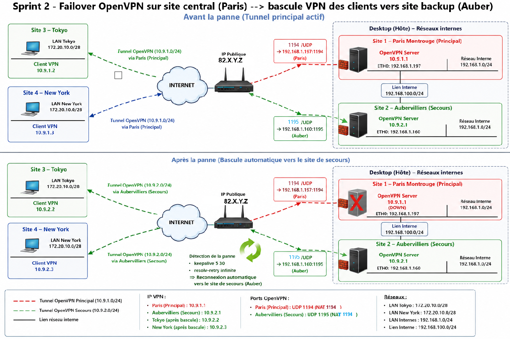

# 🏁 Sprint 2 :  OpenVPN Backup Site Deployment & Automated Network Failover 

## Sprint Objectives
- Deploy a secondary OpenVPN backup VPN server (Aubervilliers).
- Ensure network‑level high availability (HA) between Paris ↔ Tokyo/New York.
- Implement automatic network failover when the primary VPN server (Paris) becomes unavailable/goes offline.
- Simulate a failure of the primary site & Incident management on VPN servers
  
##  Architecture & Topology Overview



### Backup Site Role (Aubervilliers)
- Aubervilliers acts as the secondary VPN hub.
- Must be reachable by both Tokyo and New York when Paris is down.
- Private IP of Auber : `192.168.1.160`
- LAN IP Auber-Paris internal interface : `192.168.100.210`
- Public IP of Auber : `73.B.C.D`

*Note: The public WAN IP of the Tokyo/NY client is different from Sprint 1. This is expected because the client is connected through a mobile network, where the ISP assigns a dynamic public IP that changes frequently. Therefore, in the logs shown in this sprint, the WAN IP does not start with 32.A.B.C as it did in Sprint 1.*


### Tunnel VPN Networks
- Primary tunnel: `10.9.1.0/24` (Paris)
- Backup tunnel: `10.9.2.0/24` (Auber)

## 1. PKI Setup 
In the same way that with the primary server, the authentication solution to use for implementing an OpenVPN tunnel is using X.509 certificates.

The full PKI setup (CA creation, key generation, certificate signing, installation steps) is documented here:
*[Authentication via SSL/TLS certificates](pki-certificate-authentication.md)*


## 🔧 2. OpenVPN Configuration

*Full configuration files are available in the root folder  `configs/openvpn/` directory.*

### Backup VPN Server - Key OpenVPN Directives
- `server 10.9.2.0 255.255.255.0` - Defines the backup VPN tunnel network, that will be used by Auber server/clients
- `client-to-client` - Allows VPN clients to communicate with each other.
- `port 1195` - Auber server listening port
- `ca`, `cert`, `key`, - `dh`, `tls-server` : TLS authentication

### Clients - Key OpenVPN Directives
- For Multi‑Server Failover, on clients, after the 1st directive `remote` with Paris server, add a 2nd `remote` for a second VPN connection with the backup server.
```remote 82.X.Y.Z 1195```
- `resolv-retry infinite`: Forces the client to infinitely retry resolving and connecting to the servers.
- `keepalive 5 30`: Pings the server every 5 seconds. If no response is received within 30 seconds, the client considers the tunnel broken and immediately attempts a connection restart, triggering the switch to the next remote endpoint.

Explanation : 
- Clients always try Paris first.
- If unreachable → automatically switch to Aubervilliers.

## 🔀 3. Routing Configuration & Adjustements

###  Backup Server
- **Add local route** : Declare a dynamic route to reach the Tokyo/NY LAN network by routing via the VPN tunnel: 
```text
 # openvpn server configuration
route 172.20.10.0 255.255.255.240`
```

- **Push Routes** :Clients (Tokyo/NY) will dynamically receive these routes when connecting to the backup VPN server, in the same way that the primary server.
```text
 # openvpn server configuration
push "route 192.168.1.0 255.255.255.0"
push "route 192.168.100.0 255.255.255.0"
```

### Paris Server 
- Add a second static route to the Tokyo's LAN with a higher metric that the primary route and with a gateway via Auber. This route will be used when the primary VPN is down so the metric needs to be higher, in order to choose the dynamic route already added by the VPN paris.
```console
ip route add 172.20.10.0/28 via 192.168.100.210 dev enp0s8 metric 100`
```

- Add a static route to the backup VPN subnet via Auber as gateway. This route will be used when the primary VPN is down in order for Paris to join the Tokyo LAN network via the backup VPN tunnel.
```console
ip route add 10.9.2.0/24 via 192.168.100.210 dev enp0s8
```

### iroute via CCD
OpenVPN must know which client owns which LAN, otherwise packets are dropped.
To ensure that the Aubervilliers backup server can properly handle routing back to the client subnets, OpenVPN must map internal virtual endpoints using CDD.

1. Create CCD entries for both clients (Tokyo & NY).
2. Add iroute entries to map each remote LAN to the correct client.
3. Add the directive `client-config-dir /etc/openvpn/ccd` in the auber openvpn configuration for enabling iroute.

> 📑 **Architectural Reference:** The mechanics of OpenVPN's internal routing engine, directory bindings, and the critical role of the `iroute` directive are detailed in the primary site's documentation.
See [Sprint 0: Paris Routing & CCD Configuration](01-sprint1-openvpn-site-to-site-paris.md#iroute-openvpn-internal-routing-table)


## 4. Port Forwarding for Backup VPN
Traffic coming from the public internet through the edge router (local router at Paris) is segregated using port-based forwarding:
* **Primary VPN Tunnel (Paris):** `82.X.Y.Z:1194 (UDP)` ➔ `192.168.1.197:1194`
* **Backup VPN Tunnel (Aubervilliers):** `82.X.Y.Z:1195 (UDP)` ➔ `192.168.1.160:1195`

**Purpose**: Allows remote clients to reach the backup VPN server when Paris is down.

## 5. Automated Failover Script on Backup Server
- Located at `/usr/local/bin/`
- Executed every 10 seconds via `System Timers`

### Script 
*Full script file is available in the root folder configs/openvpn/.*

**Script Purpose**

This script ensures automatic switching between the primary VPN (Paris) and the backup VPN (Aubervilliers). It continuously checks the status of the primary tunnel (if it is shut or not) and activates or deactivates the backup tunnel accordingly.

**Script Logic** : 

The script is based on two tests:
- Testing the reachability of the primary VPN server (Paris) by pinging the tunnel’s IP address `10.9.1.1`.
- Checking the status of the backup OpenVPN service (Auber) by verifying the presence of UDP port `1195` in netstat.
    
Based on these results, the script decides:
- to stop the backup VPN if the primary VPN is up
- to start the backup VPN if the primary VPN is down

### Automatic execution

A systemd timer is used for executing of the script automatically (every 10s).

1) Creation of two files:

- a file for service, that runs the script once :  `/etc/systemd/system/openvpn-failover.service`

- a file for timer (with the same name) that will trigger the service every 10 seconds :  `/etc/systemd/system/openvpn-failover.timer`

*Both systemd files are available in the folder configs/systemd/.*

2) Reload the `systemd`
```console
# systemctl daemon-reload
```

3) start your `timer` or enable it by default
```console
# systemctl start openvpn-failover.timer
# systemctl enable --now openvpn-failover.timer
```

- Check timer status: initially, the timer state needs to be `Active: active (waiting)`.

- See each execution of the failover script:
```console
journalctl -u openvpn-failover.service -f
```

- Show real‑time logs every time the timer triggers the service:  [Result](../assets/verifs/sprint2/Systemctl-status-openvpn-failover.timer-state-auber)
```console
# systemctl status openvpn-failover.timer
```


**Why using `systemd timers` ?**
- High reliability
- Precise execution intervals
- Automatic restart
- Clean logging
- Production‑grade behavior

This setup ensures that the VPN failover mechanism reacts quickly and consistently to network changes.

### Expected Behavior before the failover
- All traffic still uses the primary tunnel (Paris), that works initially.
- Backup tunnel (10.9.2.0/24) is not yet active.

## 6. Paris server failover Simulation & Incident management on VPN servers 
To stop the Paris primary server, shutdown the system service: 

```console
systemctl stop openvpn@srv-paris
```

### Post-Failure Analysis: System and Network Impacts
As soon as the main tunnel `10.9.1.0/24` is disconnected, the following network and system changes are triggered transparently.

**Dynamic Behaviour of VPN Clients (Tokyo / NY)  & Auber Backup Server**
- Route Loss: The virtual IP addresses associated with the main tunnel (`10.9.1.1` & `10.9.1.2`) are immediately flushed from the local tun0 interface.
- Retry & Failover Algorithm:
  - The client detects a timeout on port 1194.
  - the client re-try the connection to the Paris server (port `1194`).
  - Once again, a timeout is detect.
[Reconnexion Attempt Tokyo -> Paris & timeout detected](../assets/verifs/sprint2/log-tokyo-attempt-reconnexion-tokyo-paris.png)
  - The multi-remote implementation of the client configuration file is executed. Now, the client try to connect to the backup auber openvpn server  (Port `1195`) and the connection is establised.

  [Log Tokyo - Connexion Successful Tokyo -> Backup Server](../assets/verifs/sprint2/log-tokyo-attempt-connexion-tokyo-auber-successful.png)
  [Log Auber - Connexion Successful Tokyo -> Backup Server](../assets/verifs/sprint2/log-auber-attempt-connexion-tokyo-auber-successful.png)

After approximately 1 minutes, the failover tunnel is established: a new virtual IP from the `10.9.2.0/24` range is assigned to the tun0 interface.


## 7. Flow validation & Route verification - Progressive Changes to Routing Tables 

**Server Paris**
Complete disappearance of dynamic routes linked to the main tunnel (`10.9.1.0/24`).
- The `10.9.1.0/24` network and the subnet `172.20.10.0/28` via the Paris VPN tunnel have disappeared.
- The static routes to the Tokyo subnet (that has been statically injected initially) remain in place :
    - `172.20.10.0/28 via 192.168.100.210`
    - `10.0.0.0/28 via 192.168.100.210`

[Routing Table Paris Before failover](../assets/verifs/sprint2/routing-table-paris-before-failover.png)
[Routing Table Paris After failover](../assets/verifs/sprint2/routing-table-paris-after-failover.png) 
 
**VPN Clients**
 The default gateway for the `10.9.1.X` tunnel has been replaced by the IP address of the `10.9.2.X` failover interface. Clients switch to Auber (10.9.2.1) via port remote 1195.
- Before : `192.168.100.0/24 via 10.9.1.1` | `192.168.1.0/24 via 10.9.1.1`
- After : `192.168.100.0/24 via 10.9.2.1` | `192.168.1.0/24 via 10.9.2.1`

[Routing Table Tokyo Before failover](../assets/verifs/routing-table-tokyo-before-failover.png)
[Routing Table  NY Before failover](../assets/verifs/routing-table-NY-before-failover.png) 
[Routing Table Tokyo & NY After failover](../assets/verifs/sprint2/routing-table-tokyo&NY-after-failover-connexion-backup-vpn.png) 

  
**Server Aubervilliers**
- As soon as the primary tunnel is shutdown, the monitoring script (run via Systemd.time) detects it and active the Auber server OpenVPN service. The backup tunnel `10.9.2.0/24` is fully active
- The route to the Tokyo/NY LAN subnet (e.g. `172.20.10.0/28`) is dynamically injected to pass through its own VPN tunnel: `172.20.10.0/28 via 10.9.2.1`
- The routes to the Auber/Paris LAN subnet (e.g. `192.168.x.y/16`) via its own VPN tunnel: `172.20.10.0/28 via 10.9.2.1`, are dynamically injected to the VPN clients by the backup server.
- The static route to the Tokyo/NY subnet (that has been statically injected initially) remains in place but it is not used anymore, because its metric is higher that the new route injected dynamically by OpenVPN server.

[Routing Table Auber Before failover](../assets/verifs/sprint2/routing-table-auber-before-failover.png) 
[Routing Table Auber After failover](../assets/verifs/sprint2/routing-table-auber-after-failover.png) 


## Validation & Connectivity ✅  
- Ping 	OK = Tokyo → Aubervilliers (`192.168.1.160, 192.168.100.210, 10.9.2.1`) 
Analysis: Traffic is now routed through the backup VPN tunnel.

- Ping 	OK = Tokyo → Paris (`192.168.100.200`,`192.168.100.197` )
Analysis: Paris remains accessible via the local link between the two servers.
[Traceroute Tokyo → Paris ](../assets/verifs/sprint2/traceroute-tokyo-paris.png)

- Ping 	OK = Aubervilliers → Tokyo (`172.20.10.10`, `10.9.2.2`)
Analysis: LAN Tokyo/NY remains accessible via the backup VPN tunnel between the peers

- Ping 	OK  = Paris → Tokyo(`172.20.10.9`, `10.9.2.2`)
Analysis: LAN Tokyo/NY remains accessible  via the local link between the two servers. 
[Traceroute Paris → Tokyo ](../assets/verifs/sprint2/traceroute-paris-tokyo.png)


## When Paris Comes Back
- Clients reconnect to Paris (first remote), after ~1minute. 
- The monitoring script on Auber detects it and shutdown the Auber server OpenVPN service. The backup tunnel `10.9.2.0/24` is not anymore active so all of the route injected dynamically are deleted from the routing table of Auber & the client. The primary route (already added) are used.
=> the openvpn state (connexion, routing table) is similar to the one state of the initial, before the failover.


## 7. Troubleshooting
**Symptom**: Temps de bascule supérieur à 1 minute

**Cause**
Valeurs keepalive trop élevées.

**Solution**
keepalive 5 30

---

Route vers Tokyo toujours via Paris

Cause
Route statique devenue invalide après panne.

Solution
Script de failover dynamique.

---
Clients reconnectés mais réseau inaccessible

Cause
Routes non poussées par le serveur de secours.

Solution
Ajout des directives : push "route ..."

----

❌ Issue  - HTTP Request fails Tokyo → Paris (`192.168.100.200`, `192.168.1.197`)

- **Symptom**:: Ping to the Aubervilliers web server (`192.168.100.210`) work, but HTTP requests not.

- **Cause**:: The default policy FORWARD for the Linux firewall in Paris is set to DROP. TCP traffic (port 80) routed between the virtual interface tun0 and the physical interface enp0s8 was being dropped by Netfilter FORWARD policy of Paris. FORWARD chain policy dropl

- **Solution**: : Allow the traffic forwarding between VPN network & LAN-Auber-Paris network.
```console
iptables -A FORWARD -s 10.9.2.0/24 -d 192.168.0.0/16 -j ACCEPT
```

**Results**: Client Tokyo → Paris = HTTP requests successfu


<!--
# Outward
iptables -A FORWARD -i tun0 -o enp0s8 -s 10.9.1.0/24 -d 192.168.100.0/24 -j ACCEPT
# Return 
iptables -A FORWARD -i enp0s8 -o tun0 -s 192.168.100.0/24 -d 10.9.1.0/24 -j ACCEPT

-->
<!-- Autre troubleshooting possible
Backup tunnel unreachable
Wrong route metrics

### References
    See Troubleshooting – Missing iroute
    See Troubleshooting – Return Path Problems
-->

*Conclusion : My captures traces & the routing  table show how traffic is redirected to the Aubervilliers server (10.9.2.1) when paris server is shutdown to maintain access to resources and HTTP requests, demonstrating the effectiveness of my disaster recovery plan.*

