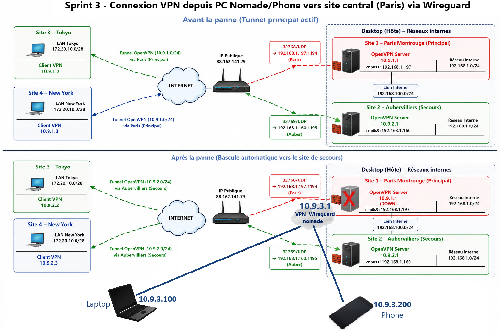

<h1> 🏁 Sprint 3 : WireGuard Remote Access VPN with VPN connection from nomad host (PC/phone) to the central site (VPN server Paris) </h1>

##  Sprint Objectives
- Set up VPN access for enabling a remote user (nomad PC / smartphone) to securely access to internal networks (Paris, Auber, Tokyo, NY).
- Deploy a modern, lightweight WireGuard VPN for remote users (nomad PC + smartphone).
- Integrate WireGuard into the existing multi‑site OpenVPN architecture.

## Why WireGuard?

WireGuard was chosen for:
- its ease of configuration;
- its performance;
- its low CPU usage;
- its use of modern cryptography;
- its minimal number of configuration lines.

Compared to OpenVPN:
| OpenVPN | WireGuard |
|----------|-----------|
| TLS | Built-in cryptography |
| More complex | Very simple |
| More resource-intensive | Very lightweight |
| Multiple certificate files | Public/private key |


##  Architecture & Topology

The Mobile/PC establishes a WireGuard tunnel to:
- Paris-Montrouge (OpenVPN primary server)
- Aubervilliers (OpenVPN backup server)

The WireGuard servers are connected to the OpenVPN network already set up in previous sprints.
The mobile client can therefore access:
- the internal networks of the central sites;
- the networks of the Tokyo and New York offices;
- the VPN addresses of the various tunnels.

###  Addressing plan 
**WireGuard Tunnel Network**:
- WireGuard subnet: `10.9.3.0/24`
- Paris server: `10.9.3.1` (UDP/49151)
- Nomad PC: `10.9.3.100`
- Iphone : `10.9.3.200`

**Physical Networks**:
- WAN Nomade PC : `176.X.Y.Z`
- WAN Paris : `88.162.141.79`
- backup OpenVPN tunnel subnet : `10.9.2.0/24`
- Paris/Auber LAN: `192.168.1.0/24`
- Inter-site Auber-Paris networks: `192.168.100.0/24`
- Tokyo/NY LAN: `172.20.10.0/28`

### Remote Access Concept
A “nomad client” is an external device (4G/5G, Wi‑Fi public, home network) with no direct access to Paris.
All access must go through WireGuard.

## Server Configuration

- Generate public & privates keys :
```bash
cd 03-wireguard-nomad/keys
umask 077
wg genkey | tee server-paris-privatekey.key | wg pubkey > server-parismont-publickey.key
```

- Set the server wireguard configuration in /etc/wireguard/wg0-paris.conf:

```text
[Interface]
Address = <IP_VPN_SERVER>                  # 10.9.3.1
ListenPort = <LISTENING_PORT>              # 49151
PrivateKey = <SERVER_PRIVATE_KEY>

[Peer]
PublicKey = <CLIENT-NOMADE-PC_PUBLIC_KEY>  # public_key of nomade-pc
AllowedIPs = 10.9.3.100/32

[Peer]
PublicKey = <CLIENT-PHONE_PUBLIC_KEY>      # public_key of the phone
AllowedIPs = 10.9.3.200/32
```

## Nomad PC Configuration
- Generate private/public keys of the PC.
- Set the wireguard configuration in /etc/wireguard/wg0-pc-nomade.conf:

```code
[Interface]
Address = <IP_VPN_PC-NOMADE>                 # 10.9.3.100/32 

[Peer]
Endpoint = <PUBLIC_IP>:<LISTENING_PORT>      # 88.162.141.79:49151
AllowedIPs = 10.9.3.0/24, 192.168.0.0/16, 10.9.2.0/24, 172.20.10.0/28
```

##  Smartphone Configuration

### Key Generation

- Generate private/public keys of the smartphone

- Set the wireguard configuration in /etc/wireguard/wg0-phone.conf:

###  Config — wg0-phone.conf
```text
PrivateKey = <PRIVATE_KEY_PHONE>
PublicKey = <PUBKEY_PARIS>
AllowedIPs = 10.9.3.0/24, 192.168.0.0/16, 10.9.2.0/24, 172.20.10.0/28
```

##  Routing Configuration

### Announce OpenVPN routes (clients)
To join to the `192.168.1.0/24`, `192.168.100.0/24`, `172.20.10.0/28` and `10.9.2.0/24` subnets, PC-nomad must route traffic through its WireGuard VPN tunnel. For doing this, these subnets must be announced to wireguard client via the directive `AllowedIPs=`. It specifies the subnets/host  whose traffic  that you want to route through your VPN tunnel. The rest of the traffic (not specified) will go via your local internet connection.

Add internal networks to AllowedIPs:
`AllowedIPs = 10.9.3.0/24, 192.168.0.0/16, 10.9.2.0/24, 172.20.10.0/28`

### Add routes for Tokyo/NY on Auber
Static routes have been added on Tokyo/NY to enable the Nomad client to reach:
- Paris-Montrouge
- Aubervilliers
- Tokyo
- New York

It will allow remote networks (Tokyo, Aubervilliers) to ‘see’ the WireGuard network `10.9.3.0/24`.

On Auber, add route for OpenVPN clients to WireGuard network via the directive push in existing OpenVPN configuration:
`push "route 10.9.3.0 255.255.255.0"`


### Add route on Auber
- Add route to WireGuard network via OpenVPN route :
- `route 10.9.3.0 255.255.255.0`

##  Firewalling & IP Forwarding

### Firewall Rules
Allow WireGuard port:
`ufw allow 49151/udp`

### Iptables Rules (NAT)
Automatisation PostUp/PostDown :
- Explication des règles de FORWARD (Autorisation du flux) et MASQUERADE (NAT dynamique).
- Justification : Pourquoi le NAT est indispensable pour le Full Tunnel (accès Internet via VPN).

```text
PostUp   = iptables -A FORWARD -i %i -j ACCEPT ; iptables -A FORWARD -o %i -j ACCEPT ; iptables -t nat -A POSTROUTING -s 10.9.3.0/24 -o enp0s3 -j MASQUERADE
PostDown = iptables -D FORWARD -i %i -j ACCEPT ; iptables -D FORWARD -o %i -j ACCEPT ; iptables -t nat -D POSTROUTING -s 10.9.3.0/24 -o enp0s3 -j MASQUERADE
```

*Why NAT is Mandatory*
- Required for Internet access
- Required for reaching internal networks
- Required for multi‑site routing

### Port Forwarding (home router)**
- Public WAN IP: `88.162.141.79`
- Rule applied: `From everywhere on Internet connecting to external port UDP/49151 ➔ to 192.168.1.197 on internal port 49151`

### IP forwarding
Kernel : Activation of `net.ipv4.ip_forward`.

## Launching WireGuard

### Server
```bash
wg-quick up wg0-paris
wg show
```
[Interface state of the server](../assets/verifs/wg-show-paris-vpn.png)

### PC-nomad Client
```bash
wg-quick up wg0-nomad-pc
```
[Interface state of the client PC](../assets/verifs/wg-show-nomad-pc.png)

### Smartphone Client - launch via QR Code Import
- Generate QR code using qrencode command
- Scan via WireGuard mobile app
- Activate interface wg0-iphone

[Configuration-Wireguard-Phone](../assets/verifs/configuration-iphone-wireguard.png)

[Ping_OK_Phone → All others subnets](../assets/verifs/ping-phone-other-subnets-ok.png)


## 6. Validation  / Connectivity 

### Ping Tests - Tunnel Connectivity ✅
- Nomad → Paris (`10.9.3.1`)
[Ping_OK_Nomade-PC → Paris-Wireguard-VPN](../assets/verifs/ping-nomad-pc_paris-wireguard.png)

- Nomad → Paris (`10.9.2.1`)
[Ping_OK_Nomade PC → Paris OpenVPN](../assets/verifs/ping-nomad-pc_auber-openvpn-ok.png)

- Nomad → Paris (`10.9.2.2`)
[Ping_OK_Nomade PC → Paris OpenVPN](../assets/verifs/ping-nomad-pc_tokyo-openvpn-ok.png)

### Ping Tests - LAN Access (Paris/Auber) ✅
- Nomad → `192.168.1.197` → OK (after AllowedIPs update)
[Ping_OK_Nomade PC → Paris-LAN](../assets/verifs/ping-nomad-pc_paris-lan-ok.png)

- Nomad → Auber (`192.168.100.210`)
[Ping_OK_Nomade Auber internal LAN](../assets/verifs/ping-nomad-pc_auber-internal-lan-ok.png)

- Nomad → Auber (`192.168.1.160`)
[Ping_OK_Nomade Auber LAN](../assets/verifs/ping-nomad-pc_auber-lan-ok.png)

- Nomad → Tokyo (`172.20.10.3`)
[Ping_OK_Nomade Tokyo LAN](../assets/verifs/ping-nomad-pc_tokyo-lan-ok.png)


### Traceroute
- Nomade → Tokyo

Observation :

Nomad → Paris (`10.9.3.1`) → Auber (`192.168.100.210`) → Tokyo

[Traceroute Nomade → Tokyo](../assets/verifs/traceroute-nomad-pc-tokyo-lan.png)

Traffic therefore passes through the central site before reaching the remote branch.

## Wireshark Analysis
Evidence of UDP encapsulation (UDP/49151).
[Capture-Wireshark](../assets/wireshark/wireguard-icmp-ping-pc-nomad-paris-lan.png)

## Routing table 
[Routing table PC Nomade](../assets/verifs/routing-table-pc-nomad-wireguard.png)
[Routing table Paris Server](../assets/verifs/routing-table-paris-wireguard.png)
[Routing table Auber Server](../assets/verifs/routing-table-auber.png)


## 🛠️ Troubleshooting 

---

### Routing issue 1 : 
- **Symptom**: The tunnel is established, but no pings from wireguard client get through to the physical networks (e.g. `192.168.1.0/24` or `192.168.100.0/24`).

- **Cause**: Incomplete AllowedIPs. WireGuard filters traffic that does not belong to the declared networks at the kernel level. Client wireguard doesn't have a route to these subnets via its wireguard tunnel.

- **Fixs**:
  - Extend the AllowedIPs on the client to include `192.168.0.0/16`.
  - On auber, add a route to the wireguard VPN subnet on the openvpn configuration file.

---

### Routing issue 2:
- **Symptom**: No pings from wireguard client get through to the OpenVPN backup subnet (e.g. `10.9.2.1/24`, `10.9.2.2/24`).

- **Cause**: Incomplete  AllowedIPs. WireGuard filters traffic that does not belong to the declared networks at the kernel level.So, client wireguard doesn't have a route to the OpenVPN subnet via its wireguard tunnel.

- **Fix**:
  - Extend the AllowedIPs on the client to include `10.9.3.0/24`.

---

### Routing issue 3:
- **Symptom**: No pings from wireguard client get through to the Tokyo/NY LAN (e.g. `172.20.10.0/24`).

- **Cause**: Incomplete  AllowedIPs so, client wireguard doesn't have a route to this subnet via its wireguard tunnel.

- **Fix**:
  - Extend the AllowedIPs on the client to include `172.20.10.0/24`.
  - Push the route to the wireguard VPN subnet on the openvpn configuration file, to the the OpenVPN clients
