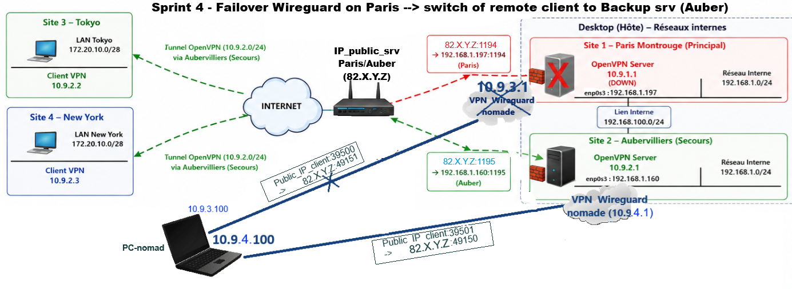

# 🏁 Sprint 4 :  WireGuard Remote Access & site-to-site VPN with Backup Server & Automatic Failover

##  1. Sprint Objectives
- Add a secondary WireGuard server on Aubervilliers.
- Ensure network‑level high availability (HA) between Paris and Aubervilliers.
- Implement automatic network failover mechanisms when the primary VPN server (Paris) becomes unavailable.
- Simulate failure of the primary site & manage incidents on VPN servers
- Support dual connectivity: Nomad → Paris & Nomad → Auber
- Validate connectivity to all LANs

## 2. Infrastructure Overview


### 2.1. Backup Site Role
- Aubervilliers acts as the secondary VPN hub.
- Must be reachable by both PC-nomade when Paris is down.
- LAN IP of Auber : `10.9.4.1/24`

### 2.2. Addressing plan 

**WireGuard Tunnel Networks**:
- Primary WireGuard subnet : `10.9.3.0/24`
      - Paris WireGuard server: `10.9.3.1` (UDP/49151)
      - Nomad PC: `10.9.3.100`
- Backup WireGuard tunnel subnet: `10.9.4.0/24`
      - Paris WireGuard server: `10.9.4.1` (UDP/49150)
      - Nomad PC: `10.9.4.100`

**Physical Networks**:
- Public/WAN IP Nomad PC : `a.b.c.d`
- Public/WAN IP Paris : `82.X.Y.Z`
- Backup OpenVPN tunnel subnet : `10.9.2.0/24`
- Paris & Auber LAN: `192.168.1.0/24`
- Inter-site Auber-Paris network: `192.168.100.0/24`
- Tokyo/NY LAN: `172.20.10.0/28`
- PC Nomade LAN: `<LAN-PC-nomade>`/24` (IP PC : <IP-LAN-pc-nomade>)

## 3.  Wireguard Configuration

### 3.1. Backup (Auber) Server

- Generate private/public keys
 
- Configure wireguard configuration in `/etc/wireguard/wg0-auber.conf` :
```text
[Interface]
Address = 10.9.4.1                        # IP_VPN_SERVER
ListenPort = 49150                        # LISTENING_PORT
PrivateKey = <SERVER_AUBER_PRIVATE_KEY>

[Peer]
PublicKey = <CLIENT-NOMAD-PC_PUBLIC_KEY>
AllowedIPs = 10.9.3.100/32, <IP-LAN-pc-nomade>
```

### 3.2. Client Nomad PC 
Two interfaces are used:
- wg0-pc-paris.conf - Primary tunnel

- wg0-pc-auber.conf - Backup tunnel  
```text
[Interface]
Address = 10.9.4.100/32                      # IP_VPN_PC-NOMADE 
PrivateKey = <PRIVATE_KEY_PC>      

[Peer]
PublicKey = <PUBKEY_AUBER>
Endpoint = 82.X.Y.Z:49150               # <PUBLIC_IP_AUBER>:<LISTENING_PORT>
AllowedIPs = 10.9.4.0/24, 10.9.2.0/24, 192.168.0.0/16, 172.20.10.0/28
```

## 4. Routing Configuration

### 4.1. Nomad PC
WireGuard uses AllowedIPs as routing table.
```text
# wg-pc-paris.conf - This allows access to: Paris LAN, Inter-server LAN, OpenVPN backup tunnel, Tokyo LAN.
AllowedIPs = 10.9.3.0/24,192.168.0.0/16,172.20.10.0/28,10.9.2.0/24
```

```text
# wg-pc-auber.conf - This allows access to: Paris LAN, Inter-server LAN, OpenVPN backup tunnel, Tokyo LAN.
AllowedIPs = 10.9.4.0/24,192.168.0.0/16,172.20.10.0/28,10.9.2.0/24
```


### 4.2. Paris routes
Paris is not directly connected to the backup WireGuard network.


### 4.3. Auber routes

Aubern, when it doesn't act as a server wireguard, initially reaches WireGuard clients through Paris via a static IP route  (Sprint 3): 
```console
ip route add 10.9.3.0/24 via 192.168.100.200 dev enp0s8 
```
When backup VPN becomes active:
- addition of dynamic routes (10.9.4.0/24 subnet & LAN PC nomadic) via 10.9.4.0/24, implemented through "AllowedIPs" :
```text
AllowedIPs = 10.9.3.100, `<LAN-PC-nomade>`
```

- Removal of obsolete static routes, implemented through: PostUp / PostDown. 
```text
PostUp = ip route del `<LAN-PC-nomade>` via 192.168.100.210 dev enp0s8 dev metric 10
PostDown = ip route add `<LAN-PC-nomade>` via 192.168.100.210 dev enp0s8 metric 10
```
Note : Given that a route to this same network is automatically added when the Auber server reboots, the route injected/delete via the Paris gw, must have a higher metric than the dynamic route, so that the latter remains the preferred route.

### 4.4. OpenVPN routes

Tokyo and New York must know the WireGuard network so this route needs to be pushed from  the current active OpenVPN server (Auber):
```text
push "route 10.9.4.0 255.255.255.0"
```

## 5. Firewall & NAT

### 5.1. Firewall Rule
Allow incoming WireGuard traffic on Auber :
`ufw allow 49150/udp`

### 5.2. Port Forwarding (Paris router)**
Rule applied: `From everywhere on Internet connecting to external port UDP/49150 ➔ to 192.168.1.160 on internal port 49150`

### 5.3. IP forwarding
Kernel : Activation of `net.ipv4.ip_forward`.

### 5.4. Iptables Rules (NAT)
```text
# Auber server conf 
PostUp = iptables -t nat -A POSTROUTING -s 10.9.3.0/24 -o enp0s3 -j MASQUERADE
PostDown = iptables -t nat -D POSTROUTING -s 10.9.3.0/24 -o enp0s3 -j MASQUERADE
```

```text
# Wireguard Client conf 
PostUp = iptables -t nat -A POSTROUTING -s 10.9.3.0/24 -o wlp6s0 -j MASQUERADE
PostDown = iptables -t nat -D POSTROUTING -s 10.9.3.0/24 -o wlp6s0 -j MASQUERADE
```

## 6. Automatic Failover

Objective :Switch automatically to the backup WireGuard server when Paris becomes unreachable and switch to Paris when primary tunnel becomes available again.

*Full script file is available in the root folder scripts/.*

### 6.1. Nomad script  
File : `/usr/local/bin/wg-failover-pc.sh`

**Logic**:
Ensuite automatic switching between the primary Wireguard VPN (Paris) and the backup Wireguard VPN (Aubervilliers). It continuously checks the status of the primary tunnel and activates or deactivates the primary and backup tunnel accordingly.

The script is based on two tests:
- Testing the reachability of the primary VPN server (Paris) by pinging the tunnel’s IP address `10.9.3.1`.
- Testing the reachability of the backup VPN server (Auber) by pinging the tunnel’s IP address `10.9.4.1`.

Based on these results, the script decides:
- Stop wireguard paris service & start wireguard backup server if Paris is down.
- Stop wireguard backup service & start wireguard paris server if Auber is up (that happens when Paris server became active again).
 
### 6.2. Auber script
`File:/usr/local/bin/wg-failover-auber.sh`

**Purpose**:
The script is based on two tests:
- Testing the reachability of the primary VPN server (Paris) by pinging the tunnel’s IP address `10.9.3.1`.
- Checking the status of the backup Wireguard service (Auber) by verifying the presence of listening server UDP port `49150` in netstat.
  
Based on these results, the script decides:
- Start backup server (if not up already) if Paris is down.
- Stop backup server (if up already) when Paris returns. 

### 6.3. Automatic execution
Automatic execution of scripts every 10 seconds using `Systemd Timers`

**Configuration**
- **Services Files** : that runs the script once
      - wg-failover-pc.service
      - wg-failover-auber.service

- **Timers** : trigger the service every 10 seconds
      - wg-failover-pc.timer
      - wg-failover-auber.timer

*Both systemd files are available in the folder configs/wireguard/systemd/.*

**Launch the automatic execution**
```console
systemctl daemon-reload
systemctl start wg-failover-{pc|auber}.timer
systemctl enable --now wireguard-failover-{pc|auber}.timer
```

### 6.4. Expected Behavior before the failover
- All traffic still uses the primary tunnel (Paris), that works initially.
- Backup tunnel (`10.9.4.0/24`) is not yet active.


## 7. Failover Simulation

To stop the Paris primary server, shutdown the wireguard service: 
```console
wg-quick down wg0-paris      
```

## 8. Post-Failure Analysis: System/Network Impacts &  Route verification   

As soon as the main tunnel `10.9.3.0/24` is disconnected, the following network and system changes are triggered transparently.

### 8.1. Paris
- Dynamic routes to the `10.9.3.0/24` & `<LAN-PC-nomade>`  network linked to the main tunnel (`10.9.3.0/24`) disappear.
- Static backup routes become active. 

```text 
10.9.3.0/24 10.9.3.1
`<LAN-PC-nomade>` 10.9.3.1
 ```
Before: [Routing Table Paris Before failover](../assets/verifs/sprint4/)


```text 
10.9.4.0/24 via 192.168.100.200
`<LAN-PC-nomade>` via 192.168.100.200
```
After: [Routing Table Paris After failover](../assets/verifs/sprint4/) 

### 8.2. Auber
- the monitoring script detects the shutdown of paris server and then, launch the Wireguard Auber service.
- The backup tunnel `10.9.4.0/24` becomes active.
- Static route to the `<LAN-PC-nomade>` via the gateway Auber-Paris disappears.
- Dynamic route to the `<LAN-PC-nomade>`  linked to the local tunnel appears.

```text
# Before:  
<LAN-PC-nomade>` via 192.168.100.210
```
[Routing Table Auber Before failover](../assets/verifs/sprint4/)

After:
```text
# After:
<LAN-PC-nomade>` via 10.9.4.1
10.9.4.0/24 via 10.9.4.1
```
[Routing Table Auber After failover](../assets/verifs/sprint4/)
 

### 8.3. Nomad PC
Clients switch to Auber (`10.9.4.1`) via port remote `49150`. The default gateway for the `10.9.3.X` tunnel has been replaced by the IP address of the `10.9.4.X` failover interface. 

```text 
# Before :  
192.168.100.0/24 via 10.9.3.1
192.168.1.0/24 via 10.9.3.1
172.20.10.0/28 via 10.9.3.1
``` 
[Routing Table VPN PC-nomad Before failover](../assets/verifs/sprint4/)

```text
# After
192.168.100.0/24 via 10.9.4.1
192.168.1.0/24 via 10.9.4.1
172.20.10.0/28 via 10.9.4.1
```
[Routing Table VPN PC-nomad After failover](../assets/verifs/sprint4/)

### 8.4. OpenVPN clients Tokyo/NY
Route toward Wireguard tunnel subnet is injected dynamically by OpenVPN Auber server.
```text
# Before: 
10.9.3.0/24 via 10.9.2.1
```
[Routing Table Tokyo After failover](../assets/verifs/sprint4/)

```text
# After: 
10.9.4.0/24 via 10.9.2.1
```
[Routing Table Tokyo After failover](../assets/verifs/sprint4/)

**Final result** : After approximately X minutes, the failover tunnel is established.

## 9. Validation & Connectivity

### 9.1. Ping Tests - Tunnel Connectivity ✅
- Nomad → Auber Wireguard server (`10.9.4.1`) = [Ping OK](../assets/verifs/sprint4/)
- Auber/Paris/Tokyo →  Nomad wireguard client (`10.9.4.100`) = [Ping OK](../assets/verifs/sprint4/)

- Nomad → Auber OpenVPN server (`10.9.2.1`) = [Ping OK](../assets/verifs/sprint4/)
- Nomad → Tokyo OpenVPN Client (`10.9.2.2`) = [Ping OK](../assets/verifs/sprint4/)


### 9.2. Ping Tests - LAN Access (Paris/Auber) ✅
- Nomad → Auber LAN IP (`192.168.1.160`) = [Ping OK](../assets/verifs/sprint4/)
- Nomad → Auber inter-site LAN IP (`192.168.100.210`) = [Ping OK](../assets/verifs/sprint4/)

- Nomad → Paris LAN IP  (`192.168.1.197`) = [Ping OK](../assets/verifs/sprint3/sprint4/)
- Nomad → Paris inter-site LAN IP (`192.168.100.200`) = [Ping OK](../assets/verifs/sprint4/)

- Nomad → Tokyo private LAN IP (`172.20.10.9`) = [Ping OK](../assets/verifs/sprint4/)

- Auber →  Nomad wireguard client (`<LAN-PC-nomade>`) = [Ping OK](../assets/verifs/sprint4/)
- Paris →  Nomad wireguard client (`<LAN-PC-nomade>`) = [Ping OK](../assets/verifs/sprint4/)
- Tokyo →  Nomad wireguard client (`<LAN-PC-nomade>`) = [Ping OK](../assets/verifs/sprint4/)


